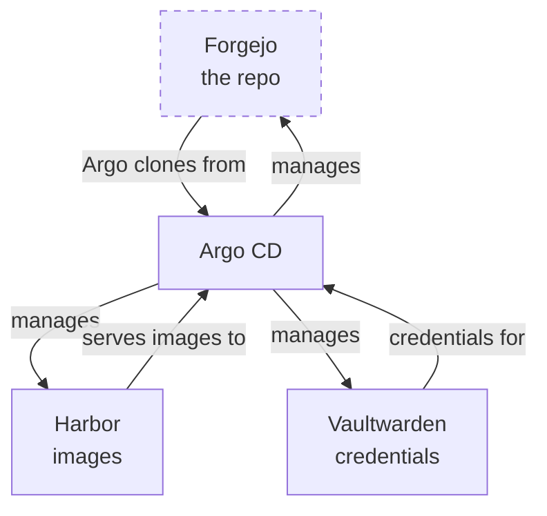

The quick honest take: the most interesting problem in my GitOps migration wasn't any individual service — it was the three services the GitOps machinery itself stands on. My Git forge (Argo reads its instructions from there), my container registry (every image pull flows through it), and my password vault (every credential bootstraps from it). Put those under automated management and you've created a loop: the system that fixes things depends on the things it's fixing.

<!-- truncate -->

## The loop, plainly

Argo CD works by cloning a Git repo and making the cluster match it. My repo lives on **Forgejo** — which runs *in the cluster Argo manages*. If a bad commit breaks Forgejo, Argo can no longer read the repo containing the fix. The repair instructions are locked inside the broken thing.

**Harbor** is softer: it's a pull-through cache, so if it dies, image pulls fall back to the internet (slow, not broken). But it also *hosts* some images with no upstream — those workloads can't reschedule while it's down.

**Vaultwarden** is the quietest one: nothing in Argo reads it directly, but every credential a human or agent uses to *operate* — including the tokens that make the whole automation run — comes out of it.

Migrating these wasn't wrong. It just required admitting the circularity instead of pretending it away.

## Write the break-glass runbook first

The single best decision of the migration: before touching any of the trio, we wrote the emergency procedures and committed them — how to operate when the loop is broken. The core insights that made everything less scary:

1. **The repo is never hostage.** It exists in three places: Forgejo (primary), a GitHub mirror (auto-synced on every push), and my laptop clone. Forgejo dying loses me nothing but convenience.
2. **`kubectl apply` never stops working.** GitOps is a layer on top of Kubernetes, not a replacement. Worst case, I'm back to last week's workflow.
3. **You can tell Argo to stop.** Scale its controller to zero and the machine goes quiet while you think. (Foreshadowing: two days later, during a DNS incident, this exact move saved the evening.)

## The design: deploys yes, autonomy no

The trio got a deliberately weaker sync policy than everything else: commits deploy automatically, but **self-heal is off**. Argo never *autonomously* restarts the foundations it stands on — drift shows up as a visible "OutOfSync" for a human to judge, instead of triggering a restart of the Git server mid-clone.

## Harbor fights back

Harbor produced the best technical puzzle. Its Helm chart *regenerates four internal secrets every single time it renders* — different values every render, by design. Under normal GitOps that's a disaster: Argo would see permanent drift, sync forever, and every sync would rotate Harbor's internal trust tokens and restart its core services. An infinite self-inflicted outage.

The proof was satisfyingly empirical: render the chart twice, diff the outputs, and there they are — four secrets and three checksum annotations that differ run-to-run. The fix is an Argo feature made for exactly this: `ignoreDifferences` (don't consider these fields drift) plus `RespectIgnoreDifferences` (don't overwrite them when syncing either — the second half everyone forgets).

The result: Harbor was adopted with **zero pod churn**. Every pod kept its multi-day age through the takeover. The best migrations are indistinguishable from nothing happening.

## The self-referential moment

Forgejo went last, and the loop demonstrated itself in the act of closing: the Argo sync that created the "manage Forgejo" Application had to *read that instruction from Forgejo*. The forge served the request to bring itself under management, uneventfully, while its own pods kept running.

There's something genuinely pleasing about a system that contains its own description — as long as you've also printed a copy and left it outside the building.

## What I'd tell you to steal

If you're doing this at home: migrate the self-referential services *last*, write the break-glass doc *first*, turn self-heal *off* for anything the loop depends on, and make sure your repo exists somewhere the loop can't reach. The circularity never goes away — you just make it a documented, deliberately-weakened corner of the system instead of a surprise.
