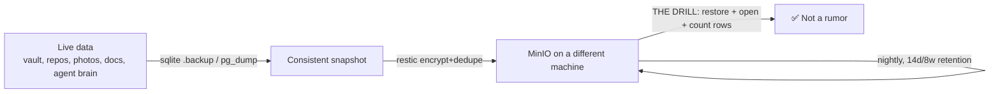

The quick honest take: until last week, my password vault — the single file every credential in my house depends on — existed as exactly one copy on one disk in one machine. If that disk died, I'd have lost every homelab credential simultaneously. If that sentence describes something in your life (it does; it describes something in everyone's life), this post is the nudge: the backup system took one evening to build, and the *restore drill* — the part everyone skips — is the only part that made it real.

<!-- truncate -->

## What deserves backing up (and what doesn't)

The first useful decision was a scope rule that fits in one sentence: **never back up anything the internet can restore.** Container images, AI model weights, package caches, torrents — all re-downloadable, all excluded. What's left is surprisingly small:

- The password vault (760 KB — the most precious kilobytes in the house)
- The Git forge's data (every repo *plus every issue* — my ops logbook exists nowhere else)
- Photos (Immich), documents (Paperless) — the genuinely irreplaceable life-stuff
- The AI agent's "brain" (its personality file, skills, memory — weirdly irreplaceable)

Applying the rule to the agent's own storage was satisfying: its runtime directory is 2.8 GB, but most of that is re-installable binaries and libraries. The parts that matter — the parts no internet can restore — are a fraction of it, and the backup config skips the rest by name.

## The design in one breath

Nightly [restic](https://restic.net/) jobs (encrypted, deduplicated) push each dataset to a dedicated MinIO server whose one design rule is: **never share a node with the data you protect.** The vault lives on one machine; its backups land on another machine's disk. Databases get *consistent* snapshots — SQLite via its own backup API (a raw file copy of a live database can tear mid-write), Postgres via `pg_dump` — rather than naive file copies. Fourteen daily and eight weekly snapshots, with a 10% integrity read-back on every run.

One subtlety I'm proud of, because it's the kind of thing you only catch by thinking adversarially: the restic encryption password is stored in the password vault... which is one of the things being backed up. **A password that lives only inside the vault cannot decrypt the vault's own backup.** So it's escrowed in a second place entirely outside the cluster. Circular dependencies hide everywhere in self-hosted setups; this one would have made the backups ornamental.

## The drill (three attempts, two self-inflicted)

"An untested backup is a rumor" was the doctrine going in, so the build wasn't done until we'd restored the vault's backup and read data out of it. This took three attempts, and I'm keeping the failures in the story because they're the honest part — both were bugs in *our verification harness*, not the backups:

1. **Attempt one:** the restore worked, but the verification container mounted the restored files read-only — and SQLite refuses to open even read-only without being able to create its lock files. Verified nothing.
2. **Attempt two:** fixed that; then the cleanup step in the same command deleted the restore job *before its logs were read*. (Twice, actually. There's a lesson about not putting cleanup in the same breath as the thing you're inspecting.)
3. **Attempt three:** `integrity_check: ok`. Two users, twenty-five ciphers, one organization — real decrypted data, read from a restored copy, counted.

That last line is the entire difference between "we have backups" and "we have restores." The first is a checkbox; the second is a capability you've actually demonstrated.

## The honest gap

Everything above lives in one house. A fire, flood, or particularly ambitious power surge defeats all of it. The offsite copy — a second restic target in a cloud bucket, roughly a dollar a month at these sizes — is scoped and waiting on nothing but a decision. I mention it because every backup post that doesn't admit its gap is selling something.

## Steal this

If you self-host anything with state: pick the short list of things the internet can't restore, put restic between them and a disk that isn't the same disk, and then — this is the whole post — **restore one and open it.** Tonight. The drill takes twenty minutes and converts your rumor into a fact.
