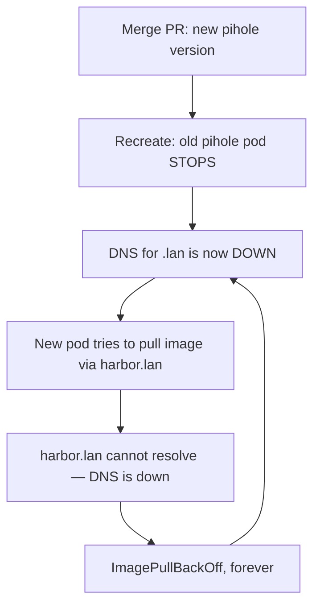

The quick honest take: I merged what looked like the most boring pull request in the world — a version bump for Pi-hole, my home DNS server — and the whole house lost the internet-as-my-family-knows-it for about fifteen minutes. The bug was a genuine circular dependency, the recovery was a break-glass runbook working exactly as written, and the permanent fix was three lines in `/etc/hosts`. If you like distributed-systems puzzles that fit in a kitchen, this one's a gem.

<!-- truncate -->

## The setup

Three facts, each reasonable alone:

1. **Pi-hole serves DNS for my LAN** — including the `.lan` names my cluster's machines use to find things. One of those names is `harbor.lan`, my container registry, which every image pull flows through.
2. **Pi-hole's pod uses a `Recreate` deployment strategy** — the old pod must fully stop before the new one starts, because both need the same host port 53. No overlap possible.
3. **Upgrading Pi-hole means pulling a new container image** — through `harbor.lan`.

Read those again in order. The upgrade *kills the DNS server*, then tries to *pull the new image*, which requires *resolving `harbor.lan`*, which requires... the DNS server. The upgrade needs the thing the upgrade just killed.

## The twist: the robot fights the rollback

The obvious first move: roll the deployment back to the old image, which is still cached on the node — no pull, no DNS needed. Done. Except thirty seconds later the deployment was *back on the broken version*.

The culprit was our own automation being exactly as good as designed: Argo CD's self-heal saw manual drift from the git-declared state and reverted it. And here's the detail that made me laugh out loud later — **Argo didn't need DNS to do this**, because it heals from its *cached* copy of the desired state. The whole GitOps loop was DNS-dead (Argo couldn't clone from `forgejo.lan` either), but the immune system kept working from memory, faithfully re-breaking DNS.

## Break-glass, as written

Two days earlier, before migrating the scary services, we'd written an emergency runbook for "operating when the loop is broken." It got its first live test:

1. **Scale the Argo controller to zero.** The machine goes quiet; nothing re-heals.
2. **Roll pihole back to the cached image** with plain kubectl. DNS returns in seconds.
3. **Pre-pull the new image** — now that DNS works, fetch it onto the node *before* trying the upgrade again.
4. **Wake Argo back up.** It self-heals to the new version, which now starts instantly from the local cache. Total blip: seconds.

The upgrade I'd merged actually completed — just with a human holding the sequence in the right order. The runbook paid for itself in one incident.

## The permanent fix

The class of bug dies with one move: every node now has `harbor.lan` pinned in `/etc/hosts`, which the resolver consults *before* DNS. Image pulls no longer depend on Pi-hole at all — including Pi-hole's own future upgrades, which now cause a seconds-long blip instead of a deadlock.

## Bonus gremlin: the MTU bug

Same week, different network ghost. Our CI runner builds container images inside Docker-in-Docker, inside Kubernetes, and every build that downloaded anything substantial died with `ECONNRESET` — while small requests worked perfectly. That symptom pair (small OK, big dies) is the classic signature of an **MTU mismatch**: the cluster network caps packets at 1450 bytes, but the inner Docker bridge defaulted to 1500. Oversized packets were silently blackholed mid-download.

One flag (`--mtu=1400` on the inner daemon) fixed every future CI build. The diagnosis path is the reusable part: works on my laptop → works in a plain pod → fails only in dind → compare the interface MTUs. When big transfers die and small ones don't, measure your packets before blaming the internet.
