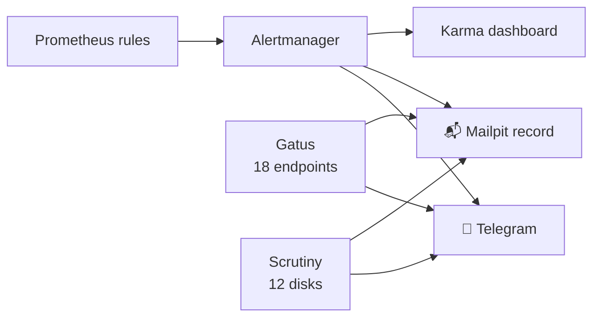

The quick honest take: for weeks my cluster had carefully-written alert rules — node down, disk filling, model server misbehaving — and **nowhere to send them**. Prometheus evaluated every rule faithfully and the results went into the void, because I'd never installed the component that routes alerts to humans. If you run Prometheus at home, go check right now whether you actually have Alertmanager. I'll wait. This post is what happened after I found out I didn't.

<!-- truncate -->

## The motivating incident

A week earlier, one of my nodes — a laptop that runs my in-cluster AI agent — silently died at 5:40 AM. Battery drained; someone had unplugged it. Nothing noticed for **twelve hours**, until unrelated work happened to surface it. Twelve hours of "the cluster is fine" while a fifth of it was off.

That's the thing about monitoring without alerting: it's a diary, not a smoke detector. The data was all there. Nobody was reading it at 5:40 AM.

## The missing organ

The discovery moment was almost funny: "let's set up alert routing" → "where does Alertmanager run?" → *there is no Alertmanager*. My alert rules had been evaluated for weeks, transitioning dutifully between `inactive` and `firing`, visible to exactly no one.

The evening's build, driven by Claude with me supplying one Telegram bot token:

- **Alertmanager** — the router. Rules now have somewhere to go.
- **Telegram as the primary channel** — a bot that messages my phone. Setup was genuinely three steps: ask BotFather for a bot, put the token in the vault, send the bot one "hi" (which is how the agent auto-discovered my chat ID).
- **Mailpit as the always-on record** — a fake SMTP inbox in the cluster. Every alert lands there too, so there's a paper trail even if I fat-finger the Telegram config.
- **Karma** — a dashboard over Alertmanager for when the phone buzzes and I want the full picture with silencing buttons.
- **New rules earned from history** — including node-down-for-5-minutes, so the battery incident can never run twelve hours again. (Embarrassing detail: the first version of that rule referenced a scrape job name that didn't exist — a decorative alert that could never fire. Caught in review. Test your smoke detectors.)

Then the same two channels got wired into everything else that emits: **Gatus** (18 endpoint health checks) and **Scrutiny** (SMART health on all 12 physical disks). One phone, one inbox, every emitter.

## The first real catch

Minutes after the pipeline went live, a *real* alert arrived between the test messages: a vLLM model server target, down. It had been "firing" invisibly for ages — the void finally had a floor. Which immediately taught the next lesson:

## Parked is not down

My inference fleet doesn't all run at once — GPUs are finite, so model servers get parked (scaled to zero) and unparked constantly. To a naive `up == 0` rule, a parked service is indistinguishable from a dead one, and my phone would buzz forever about services I'd *deliberately* turned off.

The fix is a philosophy, not a filter: **presence is not a signal in the inference namespace; behavior is.** The presence alerts got deleted for that fleet. What remains are metric-derived rules — KV-cache pressure, requests backing up, slow time-to-first-token — which *physically can't fire* unless a model is actively serving traffic, and go silent the moment it parks. Alerts about running things struggling: yes. Alerts about intentional operations: never. No per-service toggling as things spin up and down — it's automatic in both directions.

## The finishing touch

Each alert carries a "Source" link to the exact Prometheus query that fired. The first ones rendered with an unclickable internal pod hostname; one `--web.external-url` flag later, they're proper `prometheus.lan` links — tap the alert on my phone, land in the graph, see the story.

## Steal this

The order of operations that worked: pick the channel you already check (for me, Telegram — the bot takes three minutes), put Alertmanager between Prometheus and it, add a dead-simple always-on record channel, and then — the part that keeps it livable — delete every alert that fires on *intentional* states. An alert system you trust is one that only speaks when something is wrong, and now, when my cluster is unhappy at 5:40 AM, my phone knows before breakfast.
