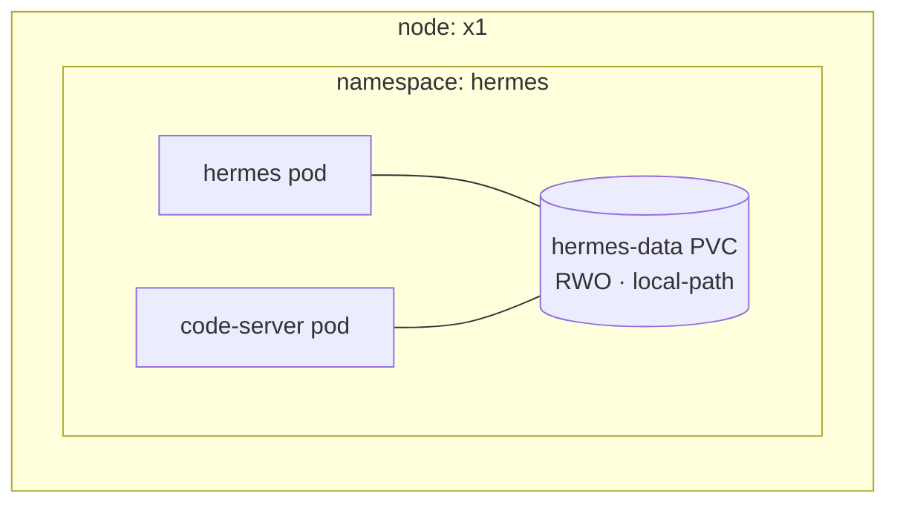

# code-server: Brain Surgery in a Browser

**What it is:** [code-server](https://github.com/coder/code-server) is VS Code running as a web app — full editor, file tree, terminal, extensions — served from the cluster at `code.lan`. Mine opens directly into the [Hermes agent's](./hermes.md) data volume: its `SOUL.md` persona, its config, its skills.

**Why I need it:** the agent's mind is a set of files on a Kubernetes volume, and "edit a file inside a PVC" is normally a miserable `kubectl exec` + vi experience. code-server turns it into a real editor with hot access to the live files. When I want to tweak how Hermes talks or teach it a new skill, I open a browser tab.

{/* screenshot: ai/code-server-soul.png — SOUL.md open in the editor, file tree showing skills/ */}

## Daily drivers

- **Editing `SOUL.md`** — personality changes take effect next session, no restart
- **Tuning `config.yaml`** — model defaults, provider settings (this one *does* need a Hermes restart)
- **Writing skills** — the agent's capabilities are markdown files; I draft them here
- **A terminal inside the cluster** — occasionally handy for poking around from the inside

## The Kubernetes lesson hiding in the deployment

Where this thing *runs* is a better k8s tutorial than most tutorials:

I wanted code-server to mount the agent's volume. That single requirement dictated everything:

1. **PVCs are namespace-scoped** — a pod can only mount volumes from its own namespace, so code-server lives *in the hermes namespace*, not one of its own.
2. **The volume is ReadWriteOnce on node-local storage** — RWO actually means "one *node* at a time", so two pods may share it *if they share a node*. code-server is therefore pinned to x1 alongside Hermes.
3. **Files inside are owned by the agent's user (uid 10000) with tight permissions** — so code-server runs *as* uid 10000, otherwise every file would be read-only decoration.

None of this is exotic; it's three fundamentals (namespace scoping, RWO semantics, uid mapping) that most people meet as production incidents instead of design inputs.

## The security sentence

Anyone with the `code.lan` password can edit the resident agent's brain and read its environment. That password is vault-strength, LAN-only, and not reused — because "web IDE with write access to an agent's soul" deserves at least that much respect.

Manifests: [`clusters/home/code-server/`](https://github.com/briancaffey/home-lab/tree/main/clusters/home/code-server) — deliberately deployed *into* the hermes namespace, with a comment explaining why, for the next person who tries to "fix" it.
