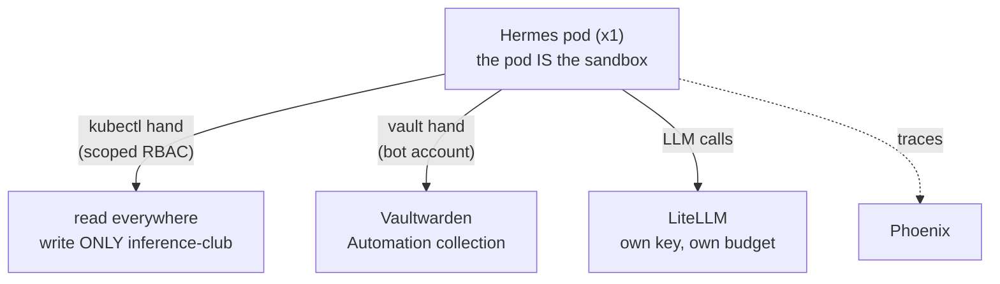

# Hermes: The Agent That Lives Here

**What it is:** [Hermes Agent](https://github.com/NousResearch) (from Nous Research) running *inside* the cluster as a first-class workload — a pod on x1 (the CPU-only ThinkPad node) with a dashboard at `hermes.lan`, an OpenAI-compatible API behind a bearer key, and its entire mind on a persistent volume. Where Claude Code operates the lab *from my laptop*, Hermes is the agent that lives *in* the lab.

**Why I run it:** partly as an experiment in what a resident agent can do, and partly because it genuinely does things — it renders videos headlessly (the hyperframes skill: HTML→video with ffmpeg and Chromium, all in-pod), answers questions about the cluster, and fetches its own credentials when a task needs them. It's also the best possible test subject for the question this whole lab keeps asking: *how much can you safely delegate?*

{/* screenshot: ai/hermes-dashboard.png — the dashboard chat view */}

## The hands (what it's actually allowed to touch)

- **kubectl hand:** a ServiceAccount with cluster-wide *read* and write *only* in the inference namespace — it can park and unpark models, restart a wedged vLLM, and diagnose anything, but it cannot touch the monitoring stack, the databases, or itself.
- **vault hand:** a `vault-secret` command wired to the same Vaultwarden bot account the human tooling uses — with ground rules baked into its skill: never print secret values, prove access by *using* a credential, exact item names only. (The full story is in [The Trust Fabric](../tissue/trust-fabric.md).)
- **Skills:** operate-the-cluster, fetch-secrets, and hyperframes video rendering — the image ships Node, ffmpeg, and headless Chromium, so "make me a video about X" renders entirely in-pod.

## SOUL.md, or: editing a personality with a text editor

Hermes' persona lives in a markdown file called `SOUL.md` on its volume. Edit the file, and the agent's voice changes on its next session. This is either profound or hilarious depending on the hour — and it's genuinely how the upstream project works. I edit it (and the rest of the agent's brain) through [code-server](./code-server.md), a browser VS Code mounted into the same volume.

## Supervision (the honest part)

API-driven agentic runs go through `/v1/runs` with an **approval gate**: tool executions pause until a human (or my own driver script with an allowlist) approves `once`, for the `session`, or `always`. And the security posture is stated plainly: the vault hand can read the whole Automation collection, so **Hermes only ever processes trusted input** — it does not read the open internet into its prompt. If that ever changes, it gets a second, smaller bot account first.

Its brain is backed up nightly by restic like everything else that matters — an agent's accumulated memory turns out to be one of the more irreplaceable things in the house.

Manifests: [`clusters/home/hermes/`](https://github.com/briancaffey/home-lab/tree/main/clusters/home/hermes).
