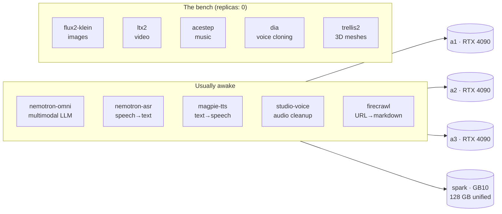

# The Inference Fleet

**What it is:** a namespace called `inference-club` where AI models live as Kubernetes services — a multimodal LLM, speech-to-text, text-to-speech, image generation, video generation, speech enhancement, web scraping, and a bench of parked experiments. Each one is a container wrapping a model server (most are [vLLM](https://github.com/vllm-project/vllm), some are NVIDIA NIMs or custom servers), and each gets a stable `https://<name>.lan` address with an OpenAPI page at `/docs`.

**Why I run it:** because "call an API" and "own the API" are different hobbies. Running models at home means no per-token bills for experimentation, no rate limits, no data leaving the house — and a forcing function to actually understand GPUs, VRAM, and scheduling. The fleet is the *reason* this cluster exists; everything else on this site is supporting cast.

{/* screenshot: ai/inference-fleet-homepage-tiles.png — the Inference group on home.lan, compact indicator row */}

## The roster

## Daily drivers

- **Chat and reasoning** through `omni.lan` (usually fronted by [LiteLLM](./litellm.md), not called directly)
- **Transcription** via `asr.lan` — audio in, text out, runs on spark's unified memory
- **Voices** from `magpie.lan` — the TTS behind various projects
- **Scraping** with `firecrawl.lan` — URL in, clean markdown out, feeds agents
- **Unparking something** when a project needs it: one `kubectl scale` and a model wakes up

## How it's configured (the interesting parts)

**GPUs are shared deliberately, not automatically.** A pod either claims a whole GPU (`nvidia.com/gpu: 1` — the scheduler enforces exclusivity) or joins the honor system (`NVIDIA_VISIBLE_DEVICES=all` with *no* GPU request — several pods share one card, and the scheduler is blind to it). There's no time-slicing or MPS; a custom `vram-reporter` keeps score out-of-band. One RTX 4090 has 24 GB of VRAM, and I know roughly what every model costs.

**Parking is a first-class lifestyle.** I can't run everything at once — video generation alone would eat a whole card — so services scale to zero and back constantly. This shaped two real architectural decisions:

- **GitOps ignores replica counts here.** The Argo CD Applications for `services/*` carry an `ignoreDifferences` rule on `/spec/replicas` — git owns *what* a service is, but *whether it's awake* belongs to me and to Hermes, and no sync ever resets a scale decision.
- **"Parked is not down"** in alerting. Presence alerts are disabled for the fleet; only *behavior* alerts (KV-cache pressure, request backlog, slow first tokens) can fire — and those are computed from live metrics, so a parked service is simply silent. See [Alerting](../observability/alerting.md).

The manifests live in [`services/`](https://github.com/briancaffey/home-lab/tree/main/services) — one directory per model server, plain YAML, each one an Argo Application.
