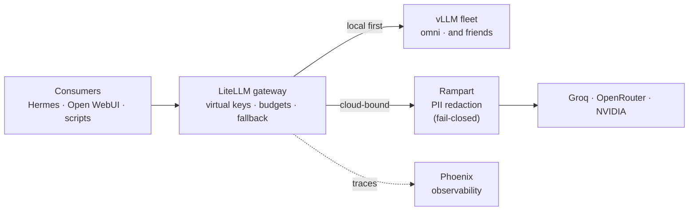

# LiteLLM: One Door to Every Model

**What it is:** [LiteLLM](https://github.com/BerriAI/litellm) is an LLM gateway — a single OpenAI-compatible endpoint that sits in front of *every* model I can reach: the local vLLM fleet on my own GPUs, plus cloud providers (Groq, OpenRouter, NVIDIA) for when a task outgrows the house. One URL, one API shape, every model.

**Why I recommend it:** without a gateway, every app and agent needs to know about every model — its address, its key, its quirks. That's N×M integrations and no visibility. With LiteLLM, consumers get *one* door, and I get the things a landlord wants: **per-consumer virtual keys with budgets** (the Hermes agent has its own key with a monthly cap), **fallback chains** (local first, cloud when needed), **spend tracking** in a real database, and **tracing** of every call into Phoenix. When a new model shows up, I add it to the gateway and every consumer can use it instantly — nobody's config changes.

{/* screenshot: ai/litellm-ui-models.png — the admin UI model list, local + cloud side by side */}
{/* screenshot: ai/litellm-ui-spend.png — spend dashboard by key */}

## Daily drivers

- **Every agent call** — Hermes, Open WebUI chat, and ad-hoc scripts all speak to LiteLLM, never to models directly
- **Model switching** without touching consumers — swap the default, everyone follows
- **Checking the bill** — the spend page answers "what did the agents cost this month?" in one glance
- **Minting keys** — a new project gets its own virtual key and budget in a minute

## How the traffic flows

The detail I'm proudest of: **cloud-bound traffic passes through [Rampart](./rampart.md) first**, a local PII-redaction service — and the coupling is *fail-closed*. If Rampart is down, cloud calls are blocked rather than sent unscrubbed. Local calls never leave the house, so they skip the bouncer entirely.

## How it's configured (the interesting parts)

LiteLLM runs database-backed (keys, budgets, and spend live in Postgres, not a config file), so key management happens in its admin UI rather than in git. The gateway's own config — which models exist, which providers back them, the fallback order — is where the real decisions live. The one lesson worth stealing: **give every consumer its own key from day one.** The first time an agent misbehaves or a project needs a budget, you'll want the blast radius and the receipts to be per-key, not shared.

The master key lives in Vaultwarden like every other credential (see [The Trust Fabric](../tissue/trust-fabric.md)); services get their keys via out-of-band Kubernetes secrets.
