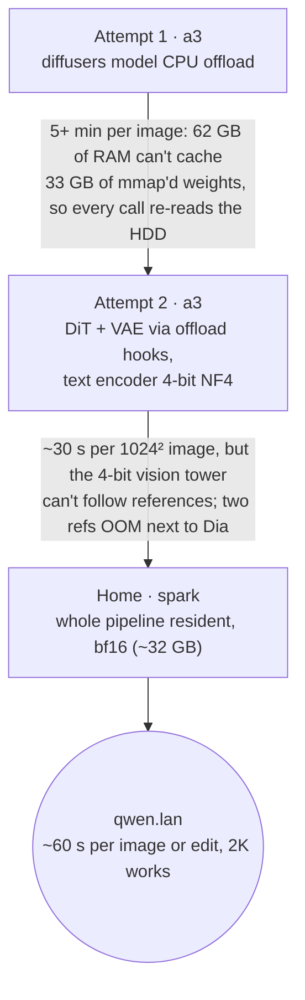

# Qwen-Image 2.1

**What it is:** [Qwen-Image 2.1](https://huggingface.co/Qwen/Qwen-Image-2.1), Alibaba's open-weight image model (released 2026-09-20), served at `https://qwen.lan` by a small FastAPI wrapper around diffusers' `QwenImage21Pipeline`. One pipeline does four jobs: text-to-image, editing against up to ten reference images (you refer to them as "image 1, image 2, …" in the prompt), region-guided edits (draw a red circle on the reference, or pass a mask as a second reference), and native RGBA output — ask for "an RGBA image with transparency … the background is transparent" and you get a real transparent PNG, no background-removal pass.

**Why I run it:** text. Every image model I have parked on the bench draws lovely pictures and mangles anything with letters in it. Qwen-Image renders a menu with prices, a comic with lettering, a poster with Chinese and English in the same frame — and in my spot checks the text came out letter-perfect. That, plus edits I can describe in one sentence instead of a node graph, was worth the fight it took to place it.

{/* screenshot: ai/qwen-image-showcase-grid.png — a 4×4 sample of the showcase gallery: bilingual menu, comic with lettering, RGBA sticker, multi-reference composite */}

## What's in the box

The model is three pieces, and their sizes are the whole story of this page:

- **Qwen3-VL 9B** text/vision encoder — **17.5 GB** in bf16. This is why editing works at all: the same tower that reads the prompt also *looks* at the reference images.
- A **7B single-stream DiT** (32 block-causal layers) — **14.2 GB**.
- A **4-channel VAE** — **1.4 GB**. The fourth channel is alpha; that is where the native transparency comes from.

Call it **33 GB of weights** before a single activation is allocated. Defaults are 40 steps with no classifier-free guidance (`true_cfg_scale` of 1; a negative prompt plus a scale above 1 turns it on). License: Qwen Research License, non-commercial — fine for a lab.

## Where it lives, and why it took three tries

An RTX 4090 has 24 GB. No card in the cluster holds this pipeline, so the question was never *which* 4090 but *how to cheat* — and it turned out that every cheat costs something I wanted.

**Attempt 1 — a3, CPU offload.** diffusers' `enable_model_cpu_offload` keeps one component on the GPU at a time (about 18 GB peak), which fits. The catch: every call streams all 33 GB back through from CPU RAM, and a3 — the control plane, with 62 GB of RAM already busy — cannot keep 33 GB of memory-mapped safetensors cached. So "from CPU RAM" quietly became "from the 5400 rpm hard disk." Five-plus minutes per image. Correct, unusable.

**Attempt 2 — a3, quantized encoder.** Keep the DiT and VAE swapping through the GPU via the offload hooks, and shrink the Qwen3-VL encoder to 4-bit NF4 (about 5.5 GB) so the whole working set fits in RAM without touching the disk. This was genuinely good: about 30 seconds per 1024² image, excellent text-to-image. And then I asked it to edit something.

:::warning[🔥 War story]
The edit test was a photo of a sign reading "HOME LAB" and the instruction *change the sign to say "GPU CLUB"*. Attempt 2 returned a grainy version of the same photo that still said "HOME LAB". Not a wrong edit — no edit. The 4-bit vision tower could still *read* prompts fine, which is why text-to-image looked flawless, but it could no longer *see* the reference well enough to act on it. Quantization did not degrade the model evenly; it broke exactly the capability I had not tested yet. Two or more references pushed it over the edge entirely — OOM, next to Dia on the same shared card — and the OOM left accelerate's offload hooks half-moved, poisoning every later call until the server reset them. (That reset is now in [`server.py`](https://github.com/briancaffey/home-lab/blob/main/services/qwen-image/server.py).) The lesson I wrote down: **quantize the component you can afford to lose, and test the feature you actually wanted, not the one that's easy to demo.**
:::

**Home — spark.** The DGX Spark's GB10 has 128 GB of unified memory, so the entire pipeline sits resident in bf16 (about 32 GB) with nothing swapped, nothing quantized. About 60 seconds per 1024² image *or* edit, multi-reference composition works, native 2K works. Slower per step than a 4090 — it is not a fast GPU — but it is the only box here that can do the whole job. The [nodes page](../hardware/nodes.md) used to say spark "runs nothing critical"; it now runs the one model nothing else can.

The a3 variant survives as [`services/qwen-image/a3-fallback/`](https://github.com/briancaffey/home-lab/tree/main/services/qwen-image/a3-fallback) — text-to-image only, applied by hand with `kubectl apply -k` when spark is offline, and deleted afterwards.

## Getting 33 GB onto an ARM box over WiFi

Nothing about moving these weights was elegant, and I'd rather write it down than pretend otherwise.

- **a3's own download** ran at ~9 MB/s over its WiFi, and a 4.4 GB PyTorch image pull kept truncating on the way. So neither pod uses a custom image: the a3 fallback reuses the `ltx2-comfy` image already cached there, and spark reuses the arm64 `vllm/vllm-openai:nightly` it already had (Python 3.12, a current torch). Both `pip install` the rest at start, with a hostPath pip cache so a restart costs seconds, not a re-download.
- **spark's uplink is ~3 MB/s**, so it never downloaded the model itself. I relayed a3's copy through my laptop at ~8 MB/s — the laptop has a better path to both boxes than they have to each other. `hf download` still runs at pod start, but it is idempotent, so once the cache is populated the pod is self-sufficient.
- **diffusers is pinned to a main-branch tarball** by commit SHA, because 2.1 pipeline support post-dates the 0.40 release. Renovate will not bump that; a human has to.

All of this is the WiFi-only-cluster tax from the [hardware page](../hardware/nodes.md), paid in a single afternoon.

## Serving

The server is a ConfigMap-mounted `server.py` — one generation at a time behind an asyncio lock, a warm-up generation at startup so `/health` only goes green after a full image has actually rendered, and PNGs saved under the node's out directory as well as returned as base64.

| Endpoint | Shape | Who uses it |
|---|---|---|
| `POST /v1/generate` | native JSON — prompt, refs as base64, size, steps, seed, filename | me, scripts, the showcase generator |
| `POST /v1/images/generations` | OpenAI images API | the inference.club agent |
| `POST /v1/images/edits` | OpenAI multipart, `image[]` + `prompt` | same |
| `GET /files/{name}` | a saved PNG | browsing outputs |

The Service carries the same `inference-club.com/type: image` labels and model annotations as flux2-klein, so the agent discovers it as an image endpoint with `input_modalities: [text, image]` and no code change. On the LAN it is `qwen.lan` (Traefik, mkcert cert) with a Homepage tile in the Inference group (abbreviation `QWN`), and it deploys as the `svc-qwen-image` Argo CD Application in [`clusters/home/argocd/apps/home-services.yaml`](https://github.com/briancaffey/home-lab/blob/main/clusters/home/argocd/apps/home-services.yaml) — with the fleet-wide `ignoreDifferences` on replicas, so parking it is still mine to decide.

GPU sharing on spark follows the honor system from the [fleet page](./inference-fleet.md): no `nvidia.com/gpu` claim, unified memory shared with whatever else is awake there (nemotron-asr, LM Studio).

## The showcase

To find out what I had actually built, I ran a 44-prompt showcase across every capability: text rendering (English and Chinese, menus with prices, infographics, comics with lettering), photorealism, art styles, native 2K and non-square aspect ratios, counting and layout, RGBA stickers/logos/cutouts, single-reference edits (background swap, add/remove objects, change the season, edit text, relight, outpaint), region-guided edits, multi-reference composition, and a CFG on/off pair. A gallery page was generated from the results; the short version is that text rendering was letter-perfect everywhere I checked, and the reference edits that Attempt 2 could not do at all are the model's most useful trick.

Manifests: [`services/qwen-image/`](https://github.com/briancaffey/home-lab/tree/main/services/qwen-image). The ingress is the `lan-qwen` block in [`clusters/home/inference-lan/ingress.yaml`](https://github.com/briancaffey/home-lab/blob/main/clusters/home/inference-lan/ingress.yaml).
