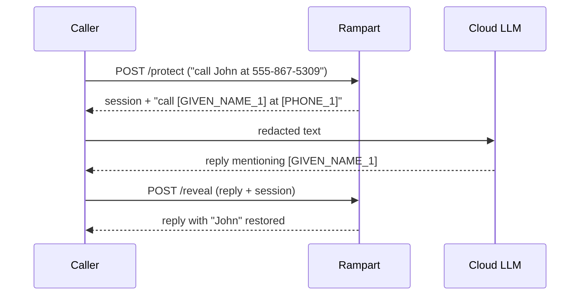

# Rampart: The PII Bouncer

**What it is:** a small local service wrapping the [nationaldesignstudio/rampart](https://huggingface.co/nationaldesignstudio/rampart) PII-redaction model — a ~19M-parameter ONNX model that finds names, emails, and phone numbers in text and swaps them for placeholders. It runs on CPU (no GPU needed), has a little playground UI at `rampart.lan`, and an API of two verbs.

**Why I need it:** the [LiteLLM gateway](./litellm.md) sends some traffic to cloud providers, and I don't want personal details riding along. Rampart sits in that path and scrubs *before* anything leaves the LAN. The critical design choice is **fail-closed**: if Rampart is down, cloud-bound LLM calls are *blocked*, not sent raw. Privacy that degrades gracefully isn't privacy — it's a suggestion.

{/* screenshot: ai/rampart-playground.png — the playground UI redacting a sample sentence */}

## Daily drivers

- **Invisible guard duty** — every cloud-bound LiteLLM call passes through it; I mostly notice it by *not* noticing it
- **The playground** — paste text at `rampart.lan`, watch entities become placeholders; great for showing guests what it does
- **The reference app** — its second life (below) as the template for every CI pipeline in the lab

## The session model

`/protect` redacts and remembers the mapping in a short-lived in-memory session; `/reveal` puts the real values back into the *response*. The cloud sees placeholders both ways; the human sees names both ways. Sessions are deliberately ephemeral (an hour) — the mapping table is meant to evaporate.

## Its second life: the CI reference app

Rampart is also the lab's **model citizen for shipping code**. Its source lives in its own Forgejo repo, and every push runs the full loop: build on the in-cluster runner → tagged image (`harbor.lan/apps/rampart:<git-sha>`) → the pipeline commits the new tag into this repo's deployment manifest → Argo CD rolls it out. No human touches the deploy. When a new app needs CI here, the answer is "do what rampart does" — the whole story is in [CI Loops](../gitops/ci-loops.md).

The deployment manifests stay in [`clusters/home/rampart/`](https://github.com/briancaffey/home-lab/tree/main/clusters/home/rampart) — GitOps-managed, with a header comment warning you not to edit the image tag by hand, because a robot owns that line now.
