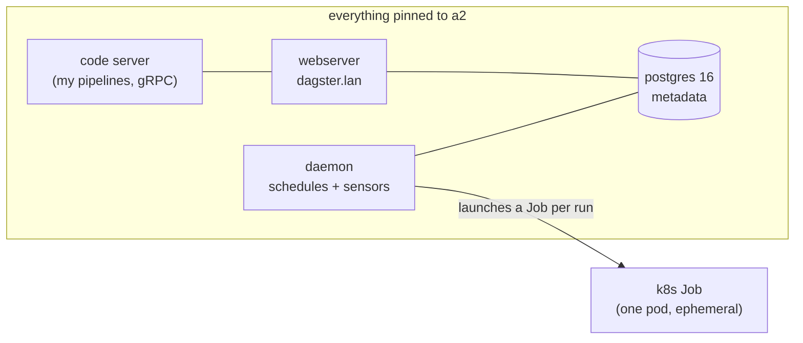
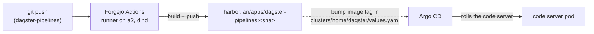

# Dagster: The Programmable Glue

**The quick honest take.** Dagster is a data orchestrator — you write pipelines as Python "assets" (a thing you want to exist, like a table or a report), Dagster figures out the order, runs them on a schedule or a trigger, and gives you a UI to watch it all. If you've heard of Airflow, it's in that family, but asset-first and much friendlier to look at. I stood it up as a **brand-new service category** — *Data / Orchestration* — because it's a different kind of thing from everything else in the lab: it's the layer that runs *code I write*, on a schedule, against the platform I already built. Mine lives on a2 at `https://dagster.lan`.

**Why I wanted it.** Up to now the lab could *host* things and *deploy* things, but it had no home for "run this bit of logic every day and do something with the result." Dagster is that home. And the fun part is what it has to work with: it can read my own Prometheus, call my own LLM gateway, pull code from my own Git forge, and run each job as its own Kubernetes Job. It's the **programmable glue** over the platform — the first service whose whole job is to *use* the other services.

**See it.**

{/* screenshot: data/dagster-ui-assets.png — the Dagster asset graph for the GPU digest pipeline */}
{/* screenshot: data/dagster-run-k8s-jobs.png — the runs list, each run its own k8s Job */}

## How it's wired

The platform lives in [`clusters/home/dagster/`](https://github.com/briancaffey/home-lab/tree/main/clusters/home/dagster), deployed by the Argo CD app `home-dagster`. It's the official `dagster/dagster` Helm chart (v1.13.13) inflated through kustomize `helmCharts:` — the same pattern as open-webui, so there's no helm-CLI release to babysit. Four moving parts:

- **Webserver** — the UI at `dagster.lan`.
- **Daemon** — runs the schedules and sensors (the thing that decides "it's time, go").
- **K8sRunLauncher** — this is the neat one: **every pipeline run executes as its own Kubernetes Job**. Nothing runs inside a long-lived worker; Dagster asks the cluster for a fresh pod per run, and you watch them come and go in `kubectl get jobs`. It's a genuinely nice demonstration of k8s-native orchestration — the orchestrator delegates execution straight to the scheduler.
- **User-deployments gRPC code server** — a separate pod that holds *my* pipeline code and serves it to the rest over gRPC, so I can ship new pipelines without restarting Dagster itself.

The metadata store is a plain `postgres:16-alpine` Deployment (the repo convention — I don't use the chart's bundled Postgres subchart), on a local-path PVC pinned to **a2**. One sharp edge worth calling out below.

## The GitOps loop for pipeline code

The Dagster *platform* lives in the home-lab repo, but the *pipelines* live in their own repo, `brian/dagster-pipelines` on Forgejo — and they ride the exact same machinery every other app in the lab uses:

Push pipeline code → Forgejo Actions builds `harbor.lan/apps/dagster-pipelines:<sha>` → I promote it by bumping the image tag in [`clusters/home/dagster/values.yaml`](https://github.com/briancaffey/home-lab/tree/main/clusters/home/dagster) → Argo rolls the code server onto the new image. Same [CI loop](../gitops/ci-loops.md), same Harbor, same Argo. Dagster didn't need a new deployment story — it just plugged into the one that was already there.

One requirement on that image: it has to install `dagster-postgres` and `dagster-k8s`. Dagster's integration libraries use the `0.X.Y` scheme that trails core by a fixed offset — **core `1.13.13` is library `0.29.13`** — so the versions have to be pinned together or the run pods fail to import.

## The flagship pipeline: "GPU digest"

The reason I'm excited about this is the first real pipeline, and it's a little tour of the whole lab in one job. "GPU digest" is a set of assets that:

1. **Query the lab's own Prometheus** for the dcgm-exporter `DCGM_FI_DEV_*` metrics (per-GPU utilization, VRAM, power, temperature) plus the custom [`vram-reporter`](../observability/prometheus-grafana.md) for the top VRAM-consuming pods.
2. **Call the [LiteLLM gateway](../ai/litellm.md)** to turn those numbers into a natural-language "state of the GPU fleet" digest — with a templated fallback if the gateway is down, so the pipeline still produces something useful.
3. Run on a **daily schedule**.

The model is configurable via a `LITELLM_MODEL` env from a ConfigMap (no image rebuild to switch models); it defaults to the local `nemotron-omni`. So the digest is my own hardware, described by my own model, orchestrated by my own scheduler — no cloud in the loop at all. It's the connective-tissue idea made literal: Dagster reads from Prometheus, thinks with LiteLLM, and the whole thing was shipped through Forgejo and Harbor.

:::warning[🔥 War story]
The first digest came back describing GPU utilization for a pod named **`DRIVERS_LICENSE_1`**. Nothing was broken — that was [Rampart](../ai/rampart.md), the PII-redaction guard, doing exactly its job. Every prompt to the LiteLLM gateway passes through Rampart, and a hashed pod name looks enough like an ID number that the redactor swapped it for a `DRIVERS_LICENSE` placeholder before the model ever saw it. It's a great illustration that the security layer is really in the path (not just theoretically), and it's the obvious next refinement: normalize pod names before they hit the gateway so the digest reads cleanly. I'd rather over-redact and fix the prose than under-redact and leak.
:::

## Access & auth

`dagster.lan` gets a Traefik ingress with the mkcert `dagster-tls` cert, and Homepage auto-discovers it under the new **Data / Orchestration** group. It's also exposed remotely at `dagster.<tailnet>.ts.net` through the Tailscale operator. Important caveat: **Dagster OSS has no built-in authentication** — there's no login screen. Access is gated entirely by being on the LAN or the tailnet (which is default-deny). That's an acceptable trade for a single-operator lab, but it's the reason Dagster is *not* something to expose more broadly than the tailnet without an auth proxy in front.

## The one sharp edge (and a known follow-up)

Two things are worth writing down for future me:

- **Postgres password ownership.** The chart wants to generate its own Postgres password Secret, which would let Argo clobber the out-of-band `dagster-postgres-secret` on every sync. The fix is `generatePostgresqlPasswordSecret: false` in values — the credential is created once, out of band, and the chart is told to keep its hands off. Same philosophy as everywhere else in the lab: secrets never live in git, and the GitOps loop is told not to fight the human who created them.
- **Why *everything* is pinned to a2.** The run and code images live in `harbor.lan/apps/`, and pulling them requires trusting the Harbor mkcert CA. a2 is Harbor-trusted, amd64, has the roomy e-disk, and co-locates with Postgres — so it's the natural home. The reason Dagster can't spread onto the [t430](../hardware/the-rest-of-the-fleet.md) yet is simply that **t430 doesn't trust the Harbor CA** — a known follow-up (`scripts/trust-harbor-ca.sh` on t430). Once that's done, the CPU-only run Jobs are a perfect fit for the weakest node in the fleet.
