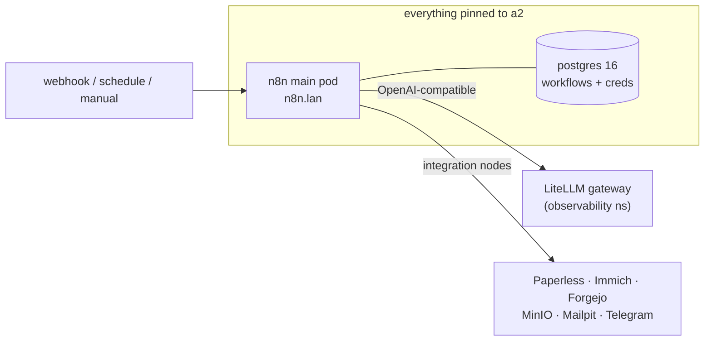

# n8n: The Event-Driven Glue

**The quick honest take.** [n8n](https://n8n.io/) is a workflow-automation tool — you wire together "nodes" on a canvas (a webhook fires, call an API, transform the JSON, post to Telegram) and it runs the flow whenever the trigger says so. Think Zapier or Make, but self-hosted, open, and with a full **Code node** when the drag-and-drop runs out. I stood it up in the lab's *Data / Orchestration* category, right next to [Dagster](./dagster.md), because it fills the other half of "run some logic and do something": Dagster is my **scheduled data pipelines**, n8n is my **event-driven / webhook / integration glue**. Mine lives on a2 at `https://n8n.lan`.

**Why I wanted it.** Dagster is wonderful for "materialize these assets on a daily schedule," but it's the wrong shape for "when *this* happens, go do *that*" — a webhook lands, a file shows up, someone pokes an endpoint. n8n is built for exactly that reactive, integration-heavy work, and it comes with a couple hundred pre-built service nodes so I'm not writing an HTTP client for every API. Paired with the [LiteLLM gateway](../ai/litellm.md), it becomes an orchestration layer that can reach *every* model and service in the house — Paperless, Immich, Forgejo, MinIO, Mailpit, the Telegram alerting bot — and stitch them together without me writing a bespoke service each time.

This is an **experimentation instance**, not a hardened production fleet: single-main, no queue mode, no Redis. Good enough to build and learn on; I'll add the scaling bits if a workflow ever earns them.

**See it.**

{/* screenshot: data/n8n-canvas-litellm.png — an n8n workflow calling the LiteLLM node */}
{/* screenshot: data/n8n-executions.png — the executions list after a few webhook runs */}

## How it's wired

The service lives in [`clusters/home/n8n/`](https://github.com/briancaffey/home-lab/tree/main/clusters/home/n8n), deployed by the Argo CD app `home-n8n`. It's the `community-charts/n8n` Helm chart inflated through kustomize `helmCharts:` — the **same pattern as Dagster**, so there's no helm-CLI release to babysit. The moving parts are deliberately minimal:

- **A single main pod** — the editor UI at `n8n.lan`, the webhook receiver, and the task runner, all in one. No separate worker/webhook deployments, because there's no queue mode yet.
- **Its own Postgres.** A plain `postgres:16-alpine` Deployment (see [`database.yaml`](https://github.com/briancaffey/home-lab/tree/main/clusters/home/n8n)) on a local-path PVC — **not** the chart's bundled Bitnami subchart. Same convention as Dagster: bring-your-own Postgres, keep the chart's opinions out of it.
- **A persistent `/home/node/.n8n` volume** for installed community nodes, settings, and logs.

Because the PVC is local-path (node-pinned) and it co-locates with its Postgres, **everything is pinned to a2** via `nodeSelector`. a2 has the roomy e-disk and is the same home Dagster picked, for the same reasons.

## The connective tissue: one door to every model

The reason n8n is more than a toy here is that it's wired straight into the [LiteLLM gateway](../ai/litellm.md). The main pod carries a `LITELLM_BASE_URL` pointing at the in-cluster gateway (`http://litellm...:4000/v1`) and a `LITELLM_API_KEY` pulled from an out-of-band secret, and I created a matching OpenAI-compatible credential in the n8n UI. So any workflow can call **any** model LiteLLM fronts — local vLLM on my own GPUs, or a cloud provider when a task outgrows the house — through the same single door every other consumer uses. n8n doesn't need to know about models; it knows about *one* gateway, and the gateway knows about everything.

That's the whole pitch for calling it glue: n8n reacts to an event, thinks with LiteLLM, and acts on Paperless / Immich / Forgejo / MinIO / the Telegram bot — all services that already exist in the lab. It's the event-driven twin of what Dagster does on a schedule.

## The "code anything" angle

Two settings make n8n's Code node a genuine sandbox rather than a toy: `NODE_FUNCTION_ALLOW_BUILTIN` and `NODE_FUNCTION_ALLOW_EXTERNAL` are both wide open, and missing npm packages auto-install on demand. That means a Code node can `require` any built-in or external module and n8n will fetch it — so when the visual nodes run out, I drop into JavaScript with the full npm ecosystem behind me. On an experimentation instance behind a default-deny tailnet that's a fine trade; on anything exposed wider it would be a knob to think hard about.

:::warning[🔥 War story]
The whole point of a stable encryption key is a lesson I'd rather learn on paper than in practice. n8n encrypts every stored credential with `N8N_ENCRYPTION_KEY`; **if that key ever changes, every saved credential becomes undecryptable garbage** — the LiteLLM credential, every API token, all of it, gone in a way no restore of the Postgres data can fix. The chart will happily *generate* a fresh key for you on install, which is a quiet trap: redeploy, get a new key, lose every credential. So the key lives in an out-of-band `n8n-encryption-key` secret (never in git, public repo), the chart is told to use it via `existingEncryptionKeySecret`, and a copy is in Vaultwarden. The Postgres password and the LiteLLM key get the same treatment — out-of-band secrets the GitOps loop is told not to regenerate.
:::

## Access & auth

`n8n.lan` gets a Traefik ingress with the mkcert `n8n-tls` cert (see [`ingress.yaml`](https://github.com/briancaffey/home-lab/tree/main/clusters/home/n8n); `lan-certs.sh` now mints `n8n.lan`), and Homepage auto-discovers it under a new **Automation** group. It's also exposed remotely at `n8n.<tailnet>.ts.net` through the Tailscale operator. Unlike Dagster, n8n *does* have its own login (owner account on first boot), but the real perimeter is the same as everything else in the lab: LAN or a default-deny tailnet, never the open internet.

## GitOps for workflows (future work)

Here's the honest gap. n8n's **native git source-control** — the feature that syncs workflows to a repo — is **enterprise-only**, so I can't lean on it. What I *did* turn on is the **Public API** (with Swagger), which is the community path to the same goal: push workflow JSON in and out of n8n over its REST API, driven from a Forgejo repo and CI, the same way [dagster-pipelines](./dagster-projects.md) rides the [CI loop](../gitops/ci-loops.md). That GitOps loop for workflows **isn't built yet** — right now workflows live only in Postgres — but the API is on and the intent is documented so future me knows the road. Until then, the encryption-key backup in Vaultwarden plus the [nightly Postgres backup](../platform/backups.md) are what stand between me and losing my flows.
