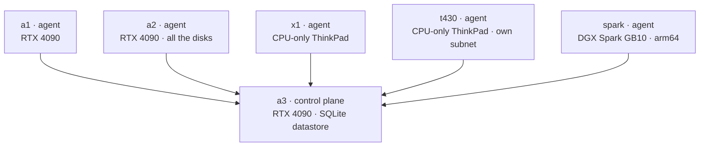

# k3s: the cluster's foundation

**What it is:** [k3s](https://k3s.io) is a lightweight Kubernetes distribution — a single binary that runs well on small machines. It is the base layer of this entire lab: every service on this site is a k3s workload.

**Why I use it:** the practical alternative to Kubernetes here is a set of Docker Compose files that each work, update, and break differently. k3s gives me one API for everything: the same `kubectl` commands that scale a language model also restart my document scanner. And unlike full Kubernetes, it doesn't require manual certificate and etcd setup to get started — one install script per machine and the cluster was running.

## Current architecture

Six machines, one of them the control plane:

The main limitation: **a3 is the only control plane, and it runs on SQLite, not etcd.** If a3 goes down, running pods keep running, but nothing can be scheduled or changed until it is back. This is a deliberate trade-off. A three-node etcd control plane on consumer hardware over WiFi would add resilience I have not yet needed, at a cost in complexity I would pay every day. For now the single control plane is the right choice, but moving to HA is a planned next step.

Adding a node is straightforward: run `scripts/install-k3s-server.sh` once for the server, then `scripts/install-k3s-agent.sh` for each agent. Even the arm64 DGX Spark on a different subnet joined without any special handling. The catch is that *joining* is the easy 10% — the token gets a node to `Ready`, but the host prep that keeps it healthy (disabling laptop sleep, WiFi power-save, inotify limits, LAN-CA trust, registry pinning) is separate, and skipping it is silent. t430, the newest agent, joined `Ready` with almost none of that applied; see [The Six Machines](/hardware/nodes) for how that went.

## Plans to migrate to HA

The single control plane is the largest availability gap in the lab, and the plan is to move to a high-availability control plane. k3s supports this directly through an embedded etcd datastore, which replaces SQLite and lets multiple servers share the control plane. The standard configuration is three servers so that etcd can tolerate losing one and still keep a quorum.

The target layout is three control-plane servers plus the remaining machines as agents. The realistic candidates for the three servers are the amd64 nodes on the main LAN — a3, a2, and a1 — because two of the current agents are poor fits for etcd:

- **spark** is arm64 and on a different subnet, so it stays an agent.
- **a1** currently has unreliable USB WiFi, which is a problem for etcd. etcd is sensitive to network latency and packet loss, and a flaky link on one server can disrupt the whole quorum.

That last point is why this migration is **gated on wired networking**. Running etcd across three nodes over consumer WiFi is fragile: the replication traffic and latency requirements are exactly what WiFi handles worst. Adding ethernet cabling (the top item on [the wishlist](/hardware/the-rest-of-the-fleet)) is a prerequisite for doing HA properly, which is why cables come before the HA work rather than after.

The migration itself also has to be done carefully, because it changes the datastore. The plan is to back up the cluster state first, convert a3 from SQLite to embedded etcd, then join the two additional servers one at a time so the quorum forms cleanly.

## Node labels and placement

Every node carries a label like `inference-club.com/box: a2`, and workloads that need to run on a specific machine say so:

- GPU services pin to the node whose RTX 4090 they use.
- Disk-heavy services pin to a2, which has most of the storage.
- The agent workloads pin to x1, the CPU-only laptop that never needs a GPU.

This is standard Kubernetes scheduling. One practical benefit of a home lab is that `kubectl get nodes` lists your own named machines rather than anonymous cloud instances, which makes placement easy to reason about.

{/* screenshot: foundations/kubectl-get-nodes.png */}

## Daily use

- `kubectl get nodes` and `kubectl -n argocd get applications` — a quick two-command health check for the whole cluster.
- Scaling GPU model servers up and down (`kubectl scale --replicas=0` is how a model is "parked").
- Giving every new service the same lifecycle: manifest → git → deployed.

## How it's configured here

Very little lives outside git: install scripts and node-label conventions are in [`scripts/`](https://github.com/briancaffey/home-lab/tree/main/scripts), and everything else is declared in [`clusters/home/`](https://github.com/briancaffey/home-lab/tree/main/clusters/home) and delivered by Argo CD. The cluster is essentially the runtime for a git repository.
