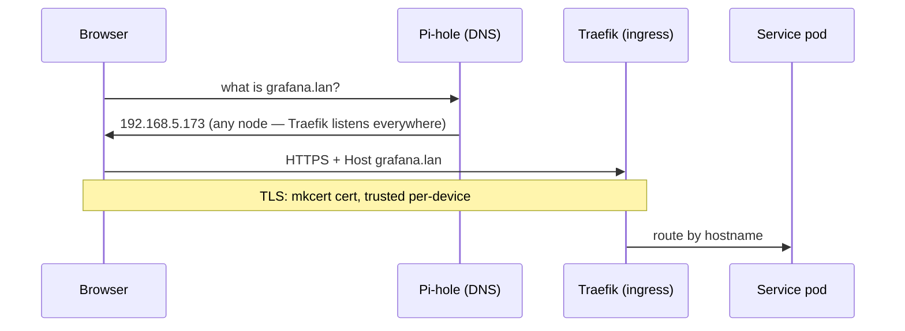

# The .lan Fabric

**What it is:** every service in this lab has a memorable HTTPS address — `https://grafana.lan`, `https://jellyfin.lan`, `https://vault.lan` — with a real green padlock, on the home network, with zero cloud involvement.

**Why I recommend building this early:** URLs are the user interface of a homelab. The moment services stopped being `192.168.5.96:30283` and became `immich.lan`, the lab went from "infrastructure project" to "something my browser and my family can actually use." It's also the foundation everything else assumes: dashboards link to each other, agents fetch APIs, CI clones repos — all by name.

## How a request finds its way

Three layers, each simple:

- **DNS** — Pi-hole answers `*.lan` with a wildcard pointing at the cluster's ingress. (It also blocks ads, which is a nice salary for a DNS server.)
- **Ingress** — Traefik (bundled with k3s) routes by hostname to the right service.
- **TLS** — a [mkcert](https://github.com/FiloSottile/mkcert) certificate authority I generated once; each device that should trust the lab installs it once.

The one gotcha that costs everyone an evening: **browsers refuse wildcard certificates directly under a top-level name.** A cert for `*.lan` looks like it should cover `grafana.lan` — Chrome disagrees. So [`scripts/lan-certs.sh`](https://github.com/briancaffey/home-lab/tree/main/scripts) lists every hostname *explicitly*, and adding a service means adding its name and re-minting. Corollary: a typo'd `.lan` name still *resolves* (wildcard DNS!) but fails TLS — which is the correct failure, once you know to expect it.

The cluster's nodes get the same treatment via split DNS: only the `lan` zone routes to Pi-hole, so a Pi-hole outage can never take a node's *general* DNS down with it.

## Remote access without opening ports

Away from home, a handful of services are reachable over [Tailscale](https://tailscale.com) — each exposed service gets its own tailnet hostname with a real Let's Encrypt certificate. The tailnet ACL is **default-deny**: nothing is reachable until explicitly granted, and only the few services worth remote access are exposed at all. Nothing is ever open to the internet.

And the decision I keep *not* making, on purpose: pointing the household router's DHCP at Pi-hole so every family device resolves `.lan` automatically. It sounds obviously good until you notice the CA is per-device anyway — family phones would resolve the names and then hit certificate warnings. `.lan` is an operator fabric; the day it should be a household one, the answer is a real domain with Let's Encrypt, not router surgery.

## Daily life with it

- Every new service costs two lines: a hostname in the cert script, an ingress in its manifests
- The Homepage dashboard at `home.lan` auto-discovers everything — the front door to the whole lab
- In-cluster pods resolve `.lan` too (CoreDNS forwards the zone), so CI can clone from `forgejo.lan` and agents can call `vault.lan`

{/* screenshot: foundations/homepage-front-door.png */}
