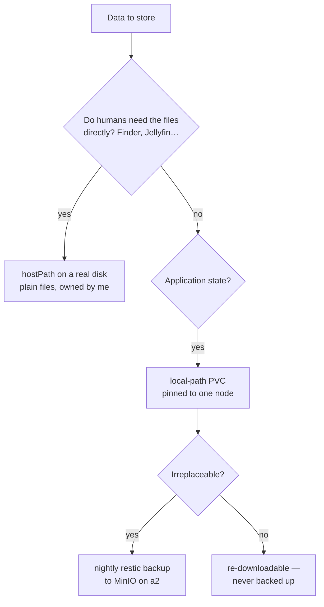

# Storage Philosophy: Boring on Purpose

**What it is:** almost everything in this cluster stores data on the plain local disk of whichever machine runs it. No distributed filesystem, no storage cluster, no magic. One doctrine holds it together: **replicate for mobility, back up for safety — and an untested backup is a rumor.**

**Why I recommend starting this way:** distributed storage is the most seductive over-engineering trap in homelabbing. It promises that any pod can run anywhere, and it delivers a second full-time job. Local disk plus *verified nightly backups* covers the actual risk (losing data) without the operational tax — and you can add replication later, deliberately, where it earns its keep.

## The decision tree

**local-path** is the default StorageClass: a PVC is just a directory on the node where the pod first landed, which pins that pod to that node forever. That's the trade — no mobility, no redundancy — and it's honest about what a homelab usually needs: the data *exists*, cheaply and simply.

**hostPath for human files** is the underrated move. Torrent downloads land at `a2:~/e/downloads` as ordinary files owned by me — browseable over Samba from my Mac like a normal folder, mounted read-only into Jellyfin, ready for any tool that's never heard of Kubernetes. The rule of thumb: *PVCs for application state, plain directories for files humans touch.* Burying your photo library inside `/var/lib/rancher/.../pvc-3f9a…` helps no one.

**Backups are the safety layer, not replication.** Everything irreplaceable — the password vault, the git forge, photos, documents, the AI agent's memory — gets a nightly [restic](https://restic.net) backup to a dedicated MinIO on a2's big disk, with retention, integrity read-backs, and (crucially) a **restore drill that actually ran**: decrypt, restore, open the database, count the rows. Re-downloadable things — container images, models, media you can re-rip — are deliberately *never* backed up. Full story on the [backups page](/platform/backups).

## The Longhorn toe-dip

There *is* one replicated volume in the house. [Longhorn](https://longhorn.io) runs on exactly two nodes (a2 + a3), replicating onto their big HDDs — never a root partition — as a deliberate learning exercise before trusting it with anything precious.

## Daily life with it

- New service? local-path PVC, two lines, done — pinning noted in the manifest
- Anything irreplaceable gets a restic CronJob the same day it starts holding data
- Disk health is watched continuously ([Scrutiny](/observability/scrutiny) — 12 drives, SMART alerts to my phone), because with node-local storage, *a dying disk is the outage*
