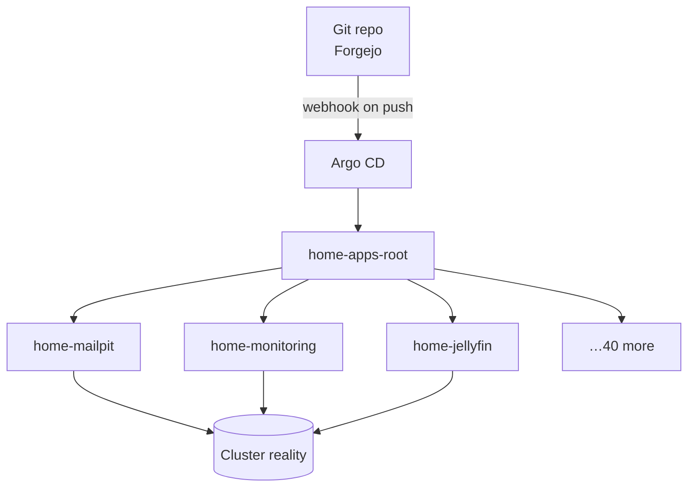

# Argo CD: The Cluster Deploys Itself

## What it is

Argo CD is the reason I almost never type `kubectl apply` anymore. The idea — called **GitOps** — is simple to state and quietly radical in practice: a git repository holds a description of everything that should be running, and a controller in the cluster continuously makes reality match it. You don't push changes *to* the cluster; you describe what you want, commit it, and the cluster pulls itself into shape.

## Why I recommend it

Before Argo CD, deploying meant remembering the right command for each service, in the right directory, with the right flags. After it, deploying means **merging a pull request**. But the killer feature turned out to be something I didn't expect: *visibility*.

{/* screenshot: gitops/argocd-tree.png — the Argo CD application tree view */}

## How it's wired

The elegant part is the **app-of-apps** pattern. One root Application (`home-apps-root`) watches a single directory — [`clusters/home/argocd/apps/`](https://github.com/briancaffey/home-lab/tree/main/clusters/home/argocd/apps) — and creates every other Application from the files it finds there. Adding a service to GitOps means committing one small block of YAML and pushing. Even the list of applications is git-driven; the root app manages itself.

Syncs are instant: Forgejo fires a webhook at Argo on every push. Without the webhook it still works — Argo polls every three minutes — but watching a merge land in the cluster before you've switched browser tabs never gets old.

## Trust tiers: not every app is treated the same

Every Application has two dials, and where they're set encodes how much I trust automation with that service:

- **`selfHeal`** — if someone hand-edits the cluster, does Argo revert it? *On* for almost everything (git is the truth). *Off* for the services the GitOps loop itself depends on (Forgejo, Harbor, Vaultwarden, Longhorn) — Argo should never autonomously restart its own foundations.
- **`prune`** — if a file is deleted from git, does Argo delete the object? *On* only for battle-tested stateless apps. *Off forever* for anything holding data. A bad commit can degrade a service, but it can never delete your photos.

What this looks like day to day:

- **Daily:** merge a Renovate PR → watch the app roll → done
- **Weekly:** `kubectl get applications -n argocd` → 44 green rows → close laptop
- **Incident:** a red row *is* the alarm, usually before anything else notices

## Where it lives

Install and configuration: [`clusters/home/argocd/`](https://github.com/briancaffey/home-lab/tree/main/clusters/home/argocd). The trickiest configuration detail: `kustomize.buildOptions: --enable-helm` in the Argo config, which lets it render the directories that inflate Helm charts — without it, a third of the lab can't build.
