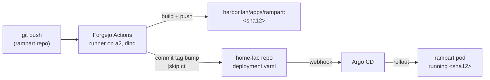

# CI: Push to Production Without Touching Anything

## What it is

For apps whose *code* I own (not just configuration), the lab runs a complete continuous-integration loop, entirely self-hosted: push code to my Forgejo, an Actions runner builds a container image, the image lands in Harbor, and a bot commit updates the deployment manifest — which Argo CD then rolls out. From `git push` to new pods serving traffic, no human touches anything.

**Rampart** — my PII-redaction service — is the reference implementation. Its journey from "code squatting in a subdirectory, built by hand on my laptop" to "own repo with a full pipeline" is the pattern every future app copies.

## Why I recommend building this

Two reasons. First, the obvious one: hand-building images (`docker build`, `docker save`, `crane push`, edit the manifest, apply…) is five error-prone steps that become zero. Second, the subtle one: **every deployed image traces to a commit SHA**. The image tag *is* the git SHA. When something misbehaves, "what exactly is running?" has a one-word answer, and "what changed?" is a `git diff`.

## The loop, end to end

The clever half is the last leg: the CI job's final step clones the *infrastructure* repo, rewrites one image tag in rampart's deployment manifest, and commits with `[skip ci]`. That commit fires the webhook; Argo does the deploy. The build system never talks to the cluster at all — it only talks to git, which is the entire point.

The runner itself ([`clusters/home/forgejo/runner/`](https://github.com/briancaffey/home-lab/tree/main/clusters/home/forgejo/runner)) is Docker-in-Docker on my beefiest node, with the build-layer cache on a persistent volume so rebuilds are quick.

## What a new app needs to join

The recipe is deliberately short — rampart's repo is the template:

- A repo on Forgejo with a `Dockerfile` and a ~40-line Actions workflow
- Two secrets: a push-only Harbor robot token, and a git token for the manifest bump
- A deployment manifest in the home-lab repo for Argo to watch

- **Daily reality:** edit code → push → two minutes later the new version is serving
- **Audit reality:** `kubectl get deploy rampart -o yaml | grep image:` → a SHA → `git show` that SHA
- **Renovate bonus:** the bot watches the app repo too, so even *dependency* bumps flow through the same build-and-deploy loop untouched
