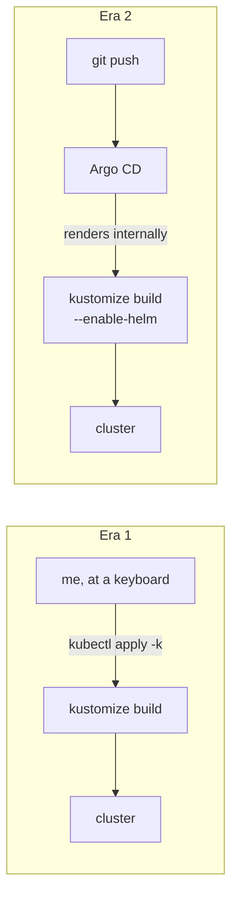

# How Kustomize's Job Changed

## What this page is

Most pages here describe a service. This one describes an *evolution* — how the same tool went from being the way I deployed everything to a rendering detail nobody thinks about. If you're building a homelab today, this is the arc you'll probably live through too, so here's the map.

## Era one: `kubectl apply -k` as the deploy verb

In the beginning, every service was a directory — `clusters/home/<name>/` with a `kustomization.yaml` listing its manifests — and deploying meant typing:

```bash
kubectl apply -k clusters/home/jellyfin
```

This was already better than raw YAML wrangling: kustomize gave me directories as deployable units, `configMapGenerator` for turning config files into ConfigMaps, and namespace stamping. The repo was the source of truth *in spirit* — but only enforced by my discipline. Nothing stopped the cluster from drifting; nothing noticed if I forgot to apply something; and every deploy was me, at a keyboard, remembering things.

## The awkward middle: Helm inflation

Some software only ships as a Helm chart. Kustomize can inflate charts (`helmCharts:` in the kustomization), which kept the one-directory-per-service model — but bought a set of sharp edges:

- `kubectl kustomize --enable-helm` broke against Helm v4, so deploys needed the *standalone* kustomize binary — a second tool with different behavior.
- Some services were full Helm releases instead, deployed with `helm upgrade`, which must **never** be applied with kubectl…

## Era two: kustomize as a rendering detail

Then Argo CD arrived, and the interesting thing is what *didn't* change: the repo layout. Directories as units, `configMapGenerator`, the same kustomizations — all still there ([`clusters/home/`](https://github.com/briancaffey/home-lab/tree/main/clusters/home)). What changed is **who runs the build**:



Argo's repo-server renders every directory itself (one config line, `kustomize.buildOptions: --enable-helm`, unlocks the chart-inflating ones). The standalone-binary dance: gone. The wrong-namespace landmine: *structurally impossible*, because Argo applies with an explicit destination namespace every time. The helm-CLI releases: migrated one by one until `helm list` returns nothing anywhere — zero Helm-managed releases remain; Helm is now just a template engine Argo invokes.

## What stayed and what died

**Stayed:** directories as deployable units · `configMapGenerator` (with stable names) · kustomize as the render layer · the mental model "one service, one folder."

**Died:** manual applies · the standalone-binary requirement · the "which tool deploys this dir?" question · the landmine list · helm-as-deployment-tool.

The tool survived; the *ceremony* around it didn't. That's the healthiest kind of evolution — and honestly the lesson of the whole GitOps migration in miniature: keep the structures that carry meaning, delete the ones that only carried risk.
