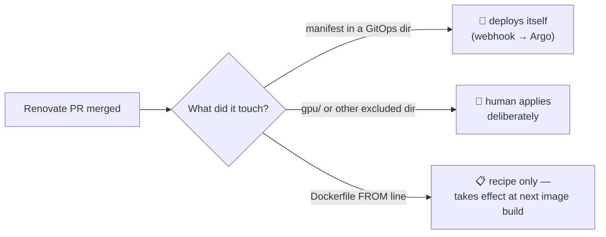

# Renovate: The Robot That Proposes

## What it is

Renovate is a bot that reads every pinned version in my repo — container image tags, Helm chart versions, even a Bitwarden CLI version buried in an initContainer's download URL — checks upstream for newer releases, and opens a pull request for each one. It runs nightly at 6 AM as a plain Kubernetes CronJob. It never deploys anything; it only *proposes*. I stay the one who merges.

## Why I recommend it

Before Renovate, "is everything up to date?" was unanswerable without an afternoon of tab-hopping across registries. Now it's one page: the **Dependency Dashboard**, an issue the bot maintains in my Forgejo listing every dependency it tracks, every pending update, and every open PR. The answer to "am I behind?" is always current, always in one place — and pleasantly specific.

The first run was humbling: it found a Grafana pinned twelve minor versions behind and a Prometheus even further back. That's the honest baseline of every hand-maintained homelab.

{/* screenshot: gitops/dependency-dashboard.png — the Dependency Dashboard issue */}

## The three flavors of PR

Not every Renovate PR means the same thing, and learning this early saves confusion:

1. **Self-deploying** — most PRs. The directory is watched by Argo CD, so merge *is* deploy.
2. **Merge-then-human-applies** — cluster-critical directories like the GPU plumbing are deliberately outside Argo's reach; merging updates git, a human applies with eyes open.
3. **Recipe-only** — a `FROM node:24-slim` bump in a Dockerfile changes the *build recipe*; nothing happens until the next image build realizes it.

## The ceremony gates

Some updates should never arrive looking routine. Three package classes are gated behind an explicit dashboard-approval checkbox, each rule earned from a real event:

- **`storage-ceremony`** (Longhorn): storage upgrades are ordered and one-way — you read release notes and check volume health first.
- **`gpu-ceremony`** (NVIDIA plumbing): an innocent-looking device-plugin bump once hid *two* breaking manifest changes and crash-looped on the first node it touched.
- **`db-ceremony`** (database majors): a Postgres 14→16 PR merged like a routine bump and took a database down in minutes — Postgres data directories don't cross major versions.

## Details worth knowing

- **Rate limiting:** 5 PRs per hour, so a behind-the-times repo drains as a trickle, not a flood. The dashboard lists what's queued; a checkbox summons any of them early.
- **It updates itself:** Renovate's own image tag is in the repo, so one morning it opened a PR to upgrade Renovate. Merging it meant the upgraded bot went looking for everyone else's upgrades. The loop is fully closed.
- **Where it lives:** [`clusters/home/renovate/`](https://github.com/briancaffey/home-lab/tree/main/clusters/home/renovate) (the CronJob) and [`renovate.json`](https://github.com/briancaffey/home-lab/blob/main/renovate.json) (the policy — grouping, gates, ignores).
