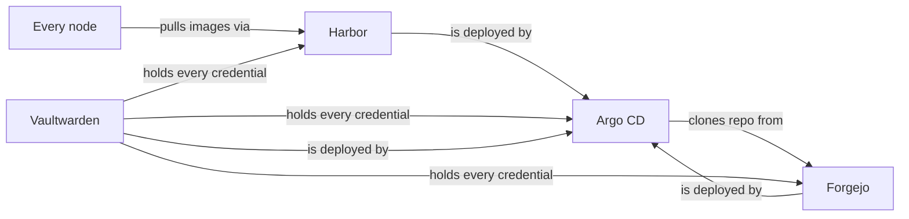

# The Circularity Trio

## What it is

Three services — **Forgejo** (my git server), **Harbor** (my container registry), and **Vaultwarden** (my password vault) — are different from everything else in the cluster: they're the services the GitOps loop itself stands on. Argo CD reads its desired state *from Forgejo*. Nodes pull images *through Harbor*. Every credential used to operate anything bootstraps *from Vaultwarden*.

Managing them with the very machinery they support creates loops where the system manages its own foundations. It's the self-hosting equivalent of performing surgery on your own hands.

## Why it matters

For every other service, "a bad commit broke it" has a boring fix: fix it *with* the GitOps system. For the trio, a bad commit could break the system you'd use to fix it — the repair instructions live inside the broken thing. Forgejo is the sharpest loop:

## The design: deliberately weaker automation

The trio runs the most conservative sync policy in the fleet:

- **Commits still deploy** (automated sync) — the workflow stays git-first.
- **`selfHeal: false`** — Argo never *autonomously* restarts the foundations. Drift shows up as "OutOfSync" for a human to judge, instead of triggering a restart of the thing Argo reads truth from.
- **`prune: false`, forever.**

Harbor needed one extra piece of surgery: its Helm chart regenerates four internal secrets *on every render*, which would make Argo perpetually out-of-sync and rotate Harbor's trust tokens on every sync. The fix — discovered empirically by rendering the chart twice and diffing — is a precise set of `ignoreDifferences` rules telling Argo exactly which fields to never touch. The adoption ended up changing nothing: every Harbor pod kept its uptime through the takeover.

## The real safety net: the repo exists in three places

The deepest answer to "what if Forgejo dies?" isn't clever Kubernetes — it's redundancy of the source of truth:

- **Forgejo** — the primary; what Argo watches
- **GitHub** — an automatic push mirror; every merge propagates within seconds
- **My laptop** — a full clone, always

Plus one fact that never changes: `kubectl apply -k` works no matter what. GitOps is how the cluster *prefers* to be operated, not the only door in. The full procedures live in the break-glass runbook at [`docs/18-gitops-break-glass.md`](https://github.com/briancaffey/home-lab/blob/main/docs/18-gitops-break-glass.md), and the trio's Application definitions are in [`clusters/home/argocd/apps/home-services.yaml`](https://github.com/briancaffey/home-lab/blob/main/clusters/home/argocd/apps/home-services.yaml).

- **Daily reality:** the trio behaves like any other app — merge, deploy, green
- **The difference:** it fails *safer*, because automation was never allowed to act on its own here
- **The lesson:** self-hosting your own foundations is fine — if you write down how to stand outside the loop *before* you need to
