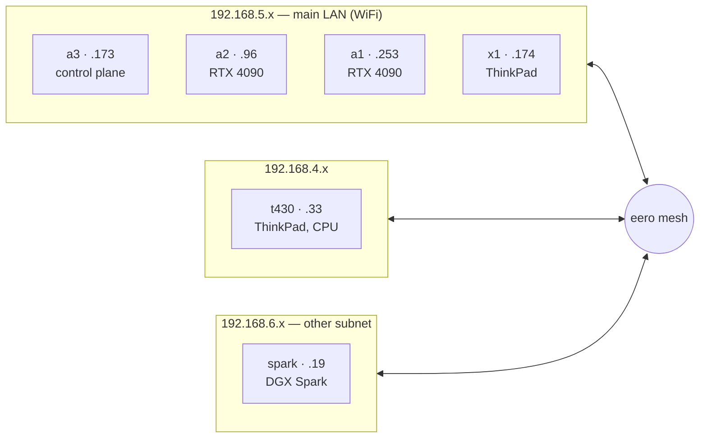

# The Six Machines

The cluster grew around GPUs first. The main goal was to run AI inference at home, so the machines were chosen for that, and the other services — media, photos, documents, Git — were added later because the hardware was already running.

It is six different computers, all on home WiFi, running k3s. They are not identical, and several design decisions in this lab exist to work around the specific limits of a specific machine.

| node | role | CPU arch | GPU | notes |
|------|------|----------|-----|-------|
| **a3** | control plane + worker | amd64 | RTX 4090 | runs the single k3s server |
| **a2** | worker | amd64 | RTX 4090 | the busiest node; most disk |
| **a1** | worker | amd64 | RTX 4090 | speech models; most spare GPU |
| **x1** | worker | amd64 | none | CPU-only laptop |
| **t430** | worker | amd64 | none | CPU-only ThinkPad; its own subnet |
| **spark** | worker | arm64 | GB10 (128 GB unified) | arm64; often offline |

## a3 — control plane

a3 runs the single k3s server, so if it goes down the cluster's API goes with it. The server uses SQLite rather than an HA setup, which is a known and accepted risk. a3 also has an RTX 4090, a 2.6 TB data disk, and hosts the services that most need stable leadership: the password vault, Prometheus, and the platform's object storage.

## a2 — the busiest node

a2 runs the most services, by a wide margin: the household DNS (Pi-hole), the Git forge, the container registry, the CI runner, every media service, and the backup target. It handles this because it has the most disk — two 2 TB NVMe drives plus 6 TB and 4 TB hard drives, and a nearly empty 5.5 TB disk used as the landing zone for downloads, backups, and storage replicas. New services usually go here.

## a1 — speech models

The third RTX 4090 machine. It hosts the speech stack: text-to-speech and speech-enhancement model servers that load and unload as needed. Because it runs fewer standing services than a2 or a3, it has the most spare GPU capacity when something new needs one.

## x1 — the laptop node

A ThinkPad X1 Carbon, CPU-only, added to the cluster to host [Hermes](/ai/hermes) — the in-cluster AI agent — and the browser-based code editor. A laptop works well as an agent host: it is quiet and low-power, and its battery acts as a built-in UPS. One caveat is that the battery can also mask a power problem: if the power cable comes loose, the machine keeps running until the battery drains and then shuts down. It now has a battery alert for this reason.

## t430 — the second laptop node

An old ThinkPad T430: four cores, 8 GB of RAM, a ~108 GB SATA SSD, and no GPU. It's the weakest machine in the fleet by a wide margin, which is exactly the point — it's here to soak up small CPU-only services and free the 4090 machines to do GPU work. Like x1, it is deliberately **not** a Longhorn storage member and holds no GPU role: a weak, WiFi-only laptop is a bad home for replicated storage or model weights. It also sits on its own subnet (192.168.4.x), so it was a useful test that a node doesn't have to share the main LAN to join.

Onboarding it is where the interesting part happened.

:::warning[🔥 War story]
t430 showed up as `Ready` in `kubectl get nodes`, and I very nearly ticked the box and moved on. But *joining* a cluster and being *prepped* for one are different things. The join only needs a token; everything that actually keeps a laptop node healthy is separate host prep — masking sleep and suspend, telling it to ignore the lid closing, turning off WiFi power-save (the single change that stops a laptop node flapping to `NotReady`), raising the inotify limits so file-watching pods don't crashloop, trusting the LAN certificate authority, and pinning `harbor.lan`. On t430, all of that had been silently skipped. It was `Ready` by luck, not by readiness. The lesson I keep relearning: a green node status only tells you the kubelet is talking to the API — it says nothing about whether the prep took. Verify the prep, don't trust the status.
:::

## spark — the arm64 node

An NVIDIA DGX Spark: arm64, a GB10 chip, and **128 GB of unified memory** shared between the GPU and CPU, which lets it hold models that do not fit on the 4090s. It differs from the other nodes in several ways: a different CPU architecture (images must be multi-arch to run on it), a different subnet, and frequent downtime. The cluster treats it as a specialist and runs nothing critical on it.

## Everything runs on WiFi

No machine in this cluster has a live ethernet cable. Storage replication, CI image pushes, and multi-GB model downloads all run over consumer WiFi. It works better than expected, and adding wired networking is the highest-value upgrade on [the wishlist](/hardware/the-rest-of-the-fleet).
