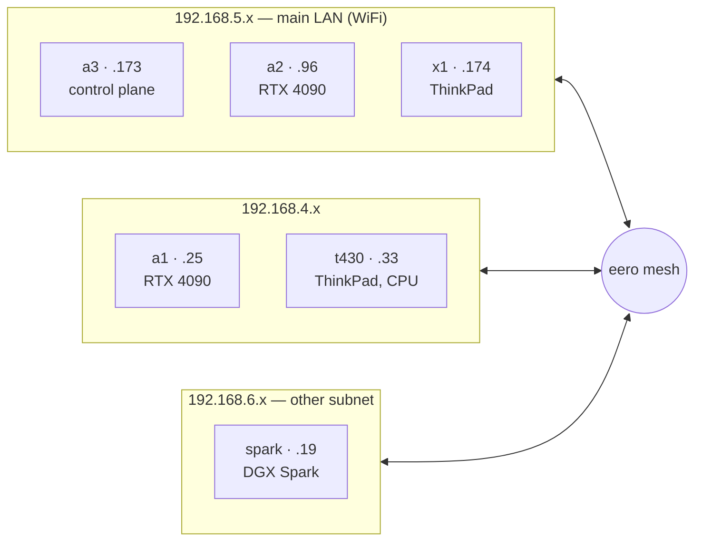

# The Six Machines

The cluster grew around GPUs first. The main goal was to run AI inference at home, so the machines were chosen for that, and the other services — media, photos, documents, Git — were added later because the hardware was already running.

It is six different computers, all on home WiFi, running k3s. They are not identical, and several design decisions in this lab exist to work around the specific limits of a specific machine.

| node | role | CPU arch | GPU | notes |
|------|------|----------|-----|-------|
| **a3** | control plane + worker | amd64 | RTX 4090 | i9-14900K; runs the single k3s server |
| **a2** | worker | amd64 | RTX 4090 | the busiest node; most disk |
| **a1** | worker | amd64 | RTX 4090 | speech models; most spare GPU; now on the .4.x subnet |
| **x1** | worker | amd64 | none | CPU-only laptop |
| **t430** | worker | amd64 | none | CPU-only ThinkPad; its own subnet |
| **spark** | worker | arm64 | GB10 (128 GB unified) | arm64; often offline |

```mermaid
flowchart LR
  subgraph lan["192.168.5.x — main LAN (WiFi)"]
    a3["a3 · .173<br/>control plane"]
    a2["a2 · .96<br/>RTX 4090"]
    x1["x1 · .174<br/>ThinkPad"]
  end
  subgraph lan4["192.168.4.x"]
    a1["a1 · .25<br/>RTX 4090"]
    t430["t430 · .33<br/>ThinkPad, CPU"]
  end
  subgraph lan6["192.168.6.x — other subnet"]
    spark["spark · .19<br/>DGX Spark"]
  end
  lan <--> router(("eero mesh"))
  lan4 <--> router
  lan6 <--> router
```

## a3 — control plane

a3 runs the single k3s server, so if it goes down the cluster's API goes with it. The server uses SQLite rather than an HA setup, which is a known and accepted risk. a3 also has an RTX 4090, a 2.6 TB data disk, and hosts the services that most need stable leadership: the password vault, Prometheus, and the platform's object storage.

It is an i9-14900K on an ASUS Z790 board, and in September 2026 it taught me the most expensive lesson in this lab so far.

:::warning[🔥 War story]
On 2026-09-22 I found a3 hot to the touch, blowing hot air, and unreachable over SSH. It had been like that for **nine hours**, and because a3 is the only control plane, the cluster API had been degraded the whole time. My first guess was a fan or a runaway GPU job. It was neither. A Linux kernel bug on the old 6.17 kernel had put two CPU cores into an infinite loop *inside the kernel*: a `fuser` process reading `/proc/*/maps` and a `kubectl` taking a page fault had both got stuck walking the same memory-map tree. Two cores at full turbo clock in a spin loop for nine hours *is* the heat. The same stuck path held the kernel's networking lock, so SSH, NetworkManager and k3s wedged with it. The kernel knew exactly what was happening — `soft lockup - CPU#12 stuck for 30629s` was the last line in the journal — but nothing on the box was configured to do anything about it. A headless machine in a kernel lockup is a space heater until a human walks over.

Why was a3 on a buggy kernel? It had a bare kernel package with no meta-package, so it never received point releases, while a1 had quietly moved on to the 7.0 HWE line without a single lockup. And the `intel-microcode` package had been removed at some point, so the 14900K was running 2023 BIOS microcode — the kernel had been tainting itself `CPU_OUT_OF_SPEC` at every boot and I had never looked. Not the cause, but exactly the CPU you do not want running stale microcode.
:::

The fix has three layers, all in [`scripts/node-lockup-guard.sh`](https://github.com/briancaffey/home-lab/blob/main/scripts/node-lockup-guard.sh), which now runs on every amd64 node as part of standard prep: the kernel is told to **panic and reboot** on a soft or hard lockup instead of spinning (about 75 seconds from stuck to booting again), the Intel chipset's **hardware watchdog** is loaded at boot and armed by systemd so the board resets itself even if PID 1 dies, and `intel-microcode` is back so the CPU boots on current microcode. On a3 the script also installed the HWE kernel meta-package, which moved it to 7.0 and, more importantly, means it keeps getting updates. A matching set of [alerts](/observability/alerting) now fires on a CPU pinned in kernel mode, a hot core, an I/O stall, or an unexpected reboot. The full postmortem, traces included, is [`docs/22`](https://github.com/briancaffey/home-lab/blob/main/docs/22-a3-thermal-runaway-postmortem.md) in the repo.

The investigation also surfaced a slower problem: a3's k3s data directory — containerd's image store plus about 14 GB of node-local database volumes — lives on a 5400 rpm hard disk, so every reboot is followed by roughly fifteen minutes of saturated I/O while everything restarts. That was not the cause of the heat, but it is why pods on a3 look flaky after a reboot. Moving that data onto the SSD is the next item on a3's list, alongside a BIOS update.

## a2 — the busiest node

a2 runs the most services, by a wide margin: the household DNS (Pi-hole), the Git forge, the container registry, the CI runner, every media service, and the backup target. It handles this because it has the most disk — two 2 TB NVMe drives plus 6 TB and 4 TB hard drives, and a nearly empty 5.5 TB disk used as the landing zone for downloads, backups, and storage replicas. New services usually go here.

## a1 — speech models

The third RTX 4090 machine. It hosts the speech stack: text-to-speech and speech-enhancement model servers that load and unload as needed. Because it runs fewer standing services than a2 or a3, it has the most spare GPU capacity when something new needs one. It has since moved to the 192.168.4.x subnet alongside t430, and it was the control group in the a3 story above: same hardware class, HWE kernel, weeks of uptime, zero lockups.

## x1 — the laptop node

A ThinkPad X1 Carbon, CPU-only, added to the cluster to host [Hermes](/ai/hermes) — the in-cluster AI agent — and the browser-based code editor. A laptop works well as an agent host: it is quiet and low-power, and its battery acts as a built-in UPS. One caveat is that the battery can also mask a power problem: if the power cable comes loose, the machine keeps running until the battery drains and then shuts down. It now has a battery alert for this reason.

## t430 — the second laptop node

An old ThinkPad T430: four cores, 8 GB of RAM, a ~108 GB SATA SSD, and no GPU. It's the weakest machine in the fleet by a wide margin, which is exactly the point — it's here to soak up small CPU-only services and free the 4090 machines to do GPU work. Like x1, it is deliberately **not** a Longhorn storage member and holds no GPU role: a weak, WiFi-only laptop is a bad home for replicated storage or model weights. It also sits on its own subnet (192.168.4.x), so it was a useful test that a node doesn't have to share the main LAN to join.

Onboarding it is where the interesting part happened.

:::warning[🔥 War story]
t430 showed up as `Ready` in `kubectl get nodes`, and I very nearly ticked the box and moved on. But *joining* a cluster and being *prepped* for one are different things. The join only needs a token; everything that actually keeps a laptop node healthy is separate host prep — masking sleep and suspend, telling it to ignore the lid closing, turning off WiFi power-save (the single change that stops a laptop node flapping to `NotReady`), raising the inotify limits so file-watching pods don't crashloop, trusting the LAN certificate authority, and pinning `harbor.lan`. On t430, all of that had been silently skipped. (The list has since grown by one: the kernel lockup guard from the a3 story above is now mandatory prep too.) It was `Ready` by luck, not by readiness. The lesson I keep relearning: a green node status only tells you the kubelet is talking to the API — it says nothing about whether the prep took. Verify the prep, don't trust the status.
:::

## spark — the arm64 node

An NVIDIA DGX Spark: arm64, a GB10 chip, and **128 GB of unified memory** shared between the GPU and CPU, which lets it hold models that do not fit on the 4090s. It differs from the other nodes in several ways: a different CPU architecture (images must be multi-arch to run on it), a different subnet, and frequent downtime. The cluster treats it as a specialist and runs nothing critical on it.

## Everything runs on WiFi

No machine in this cluster has a live ethernet cable. Storage replication, CI image pushes, and multi-GB model downloads all run over consumer WiFi. It works better than expected, and adding wired networking is the highest-value upgrade on [the wishlist](/hardware/the-rest-of-the-fleet).
