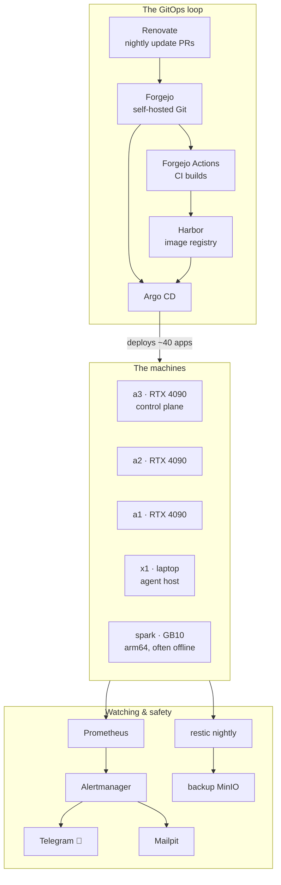

# The Lab at a Glance

This site documents my home lab: **six computers in my house running about forty self-hosted services** on Kubernetes. It includes AI models with GPUs, a photo library, a media server, a password vault, a Git server, and the tooling that keeps all of it updated, backed up, and monitored.

I built it to learn how infrastructure works by running it — a real system my household depends on, since our DNS, photos, and documents all live here. Part of the project is also using AI agents as operators: they have their own credentials, access to the secret vault, and the ability to make changes to the cluster.

Everything is driven from a single public Git repository. Each service has a folder, and each change is a commit. A bot proposes updates, I merge them, and the cluster applies the changes.

## The dashboard

The lab's front door is a self-hosted Homepage dashboard that lists every running service on one screen, grouped by area, with live status and per-node resource usage across the machines.

## The whole system on one page

Four GPU machines and one repurposed laptop, all on home WiFi (see [the hardware](/hardware/nodes)). One Git repository feeds one deployment loop, and the alerting stack watches everything else.

## What actually runs here

- **AI & inference** — vLLM model servers, image/video/speech generation, a [LiteLLM gateway](/ai/litellm) in front of them, a [PII-redaction guard](/ai/rampart), and [Hermes](/ai/hermes), an agent that runs inside the cluster with its own vault access.
- **Platform & GitOps** — [Argo CD](/gitops/argocd), [Renovate](/gitops/renovate), and the [self-hosted trio](/gitops/the-trio) of Forgejo, Harbor, and Vaultwarden that the rest depends on.
- **Data & orchestration** — [Dagster](/data/dagster), the lab's newest layer: scheduled pipelines that read my own Prometheus and write with my own LLM gateway. It's the programmable glue over everything else.
- **Household services** — [Jellyfin](/media/jellyfin), [Immich](/media/immich), [Paperless](/media/paperless), music, audiobooks, and a [download pipeline](/media/downloads) that files finished downloads for the family.
- **Monitoring** — [Prometheus & Grafana](/observability/prometheus-grafana), [alerts to my phone](/observability/alerting), [disk-health monitoring](/observability/scrutiny), and [nightly backups with tested restores](/platform/backups).

## A 3D view of the cluster

The lab has a **3D explorer**. [clusterscape](https://briancaffey.github.io/clusterscape/) renders the cluster visually: machines, pods, and the services that connect to them. It reads a sanitized snapshot of the real cluster, and it's a useful way to see how the pieces fit together.

{/* screenshot: index/clusterscape-hero.png — hero shot, Brian wants to compose this one personally */}

## Where to start

- **New to Kubernetes** → [The Six Machines](/hardware/nodes), then [k3s](/foundations/k3s) — the lab explained from the hardware up.
- **Interested in the engineering** → [The Connective Tissue](/tissue/trust-fabric) — how one credential vault, one Git repo, and a delegation ladder tie forty services into one system.
- **Here for the GitOps** → [Argo CD](/gitops/argocd) and [the CI loops](/gitops/ci-loops) — merge a pull request and the cluster updates.
- **An AI agent** → start at `/llms.txt`. Each page's frontmatter includes `repo_path` pointers to the live configuration.
