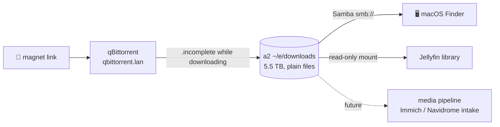

# Downloads: Where Files Actually Live

**What it is:** the acquisition end of the media pipeline — **qBittorrent** with a web UI, writing to a huge plain-directory on a2, exposed to my Mac via **Samba** and to the TV via **Jellyfin**. One paste of a magnet link; the file appears everywhere it should.

**Why this page exists:** when I set this up I asked the question every Kubernetes newcomer eventually asks: *"okay, but where do the files GO? How do I see them from my normal computer, like… Documents?"* The answer became a house doctrine worth writing down.

**See it:**

{/* screenshot: media/qbittorrent-ui.png — web UI with a completed torrent, paused at ratio 0 */}
{/* screenshot: media/finder-smb.png — the downloads share mounted in macOS Finder */}

## The doctrine: PVCs for app state, plain directories for human files

A normal Kubernetes volume buries data at `/var/lib/rancher/k3s/storage/pvc-<uuid>/…` — technically present, practically invisible. That's the right place for *application state* (databases, configs) and exactly the wrong place for *files a human wants to touch*.

So qBittorrent's config lives on a PVC, but its **downloads land on a hostPath**: a plain directory on a2's nearly-empty 5.5 TB disk, owned by my own user. `ssh a2 ls ~/e/downloads` — they're just files. Everything else follows from that one decision.

## What I actually use it for

- Paste a magnet/torrent at `https://qbittorrent.lan` → done
- Files appear in **Finder** on the Mac (`smb://192.168.5.96`, credentials in the vault) like any normal folder — drag, rename, open
- Finished video appears in **Jellyfin's** library automatically (read-only mount)
- Linux ISOs and datasets land on a disk with terabytes of headroom instead of my laptop

## The interesting configuration bits

All in [`clusters/home/qbittorrent/`](https://github.com/briancaffey/home-lab/tree/main/clusters/home/qbittorrent):

- **Leech-mode is enforced by configuration, not habit**: share ratio `0`, seeding time `0`, pause-on-complete. The moment a download hits 100%, it stops. This is a downloads appliance, not a seedbox — and the setting survives restarts because it lives in config, not memory.
- **In-progress files go to a `.incomplete` dot-directory** — Jellyfin's scanner never sees partial files, so the library only ever shows things that actually play.
- The BitTorrent peer port is a fixed NodePort, because without an inbound path, download speeds quietly suffer (Kubernetes has no UPnP fairy).
- The container writes as my own uid, so ownership on the share is just… mine. No chown archaeology.

## The full flow

