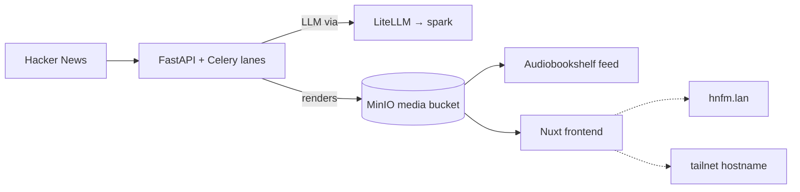

# hn.fm

**What it is:** an app I wrote that reads Hacker News, picks the stories worth a listen, scripts them with an LLM, voices them, and renders short videos and a podcast feed — all inside the cluster. It's a FastAPI backend, Celery worker lanes, a Nuxt frontend, and a render sidecar, with its own Postgres, Redis and MinIO, running on **a2** because that's where the disk is.

**Why I recommend building something like it:** every other page in this section is about running *someone else's* software. hn.fm is the one place where the lab runs *mine*, end to end — my repo, my CI, my chart, my GitOps loop — and that's where the infrastructure stops being a hobby and starts being a platform. If you've built the machinery (Forgejo, Harbor, Argo CD, LiteLLM), an app of your own is the proof it works.

## How it's deployed

hn.fm is an Argo CD **multi-source** Application, and the split is deliberate:

- The Helm chart lives *with the app*, in the [hn.fm repo](https://github.com/briancaffey/hn.fm) (`charts/hnfm/`). The app knows how it should be shaped.
- The environment values live *here*, in [`clusters/home/hnfm/values.yaml`](https://github.com/briancaffey/home-lab/tree/main/clusters/home/hnfm). The cluster knows which node, which features, which gateway.
- The app repo's CI builds the images, pushes them to `harbor.lan/apps/`, and commits a new image tag into that values file. **That commit is the rollout** — Argo notices, syncs, done.

Secrets arrive through External Secrets from a Vaultwarden item; nothing sensitive sits in either repo. The LLM calls go through the in-cluster [LiteLLM gateway](../ai/litellm.md), pinned to a local model on spark with *no* fallbacks — I don't want a Hacker News digest quietly billing a cloud provider.

## Two front doors

On the LAN it's `https://hnfm.lan`, path-routed by Traefik: `/api`, `/docs` and friends go to the FastAPI service, `/hnfm-media` to MinIO, `/flower` to the Celery dashboard, and everything else to the Nuxt frontend. Homepage auto-discovers that one under "Apps".

Away from home, the same deployment answers at `https://hnfm.<tailnet>.ts.net` via the Tailscale operator — a second Ingress in [`clusters/home/tailscale/`](https://github.com/briancaffey/home-lab/tree/main/clusters/home/tailscale) that mirrors the chart's path table exactly. If the chart's ingress ever grows a path, that file has to grow it too; the comment at the top says so, because I will forget. Homepage lists it in the static "Tailnet" group.

hn.fm has no login of its own. On the LAN that's fine; on the tailnet, the default-deny ACL *is* the gate, the same posture as every other remotely exposed service here. Nothing is open to the internet.

:::warning[🔥 War story]
Adding the Tailscale Ingress took two minutes and produced a page that loaded and then did nothing. The app was pinned to a single origin in three separate places. The Nuxt frontend called the API on an *absolute* `NUXT_PUBLIC_API_BASE` of `https://hnfm.lan` — so a browser on the tailnet name went looking for the LAN name and failed. CORS allowed exactly that one origin. And the media URLs are MinIO presigned links, which are signed for a specific `Host` — a URL signed for `hnfm.lan` and fetched via the tailnet name comes back `SignatureDoesNotMatch`. Three symptoms, one disease: **the app assumed it had one hostname.** The fix landed in the hn.fm repo, not the cluster: the API base is now empty so the browser calls `/api` on whatever host served the page (same-origin, so CORS is moot); server-side rendering can't use a relative URL, so a small Nitro catch-all route forwards `/api` to the web Service in-cluster; and the media endpoints sign presigned URLs for the origin the request *arrived on* (`X-Forwarded-Host`, falling back to `Host`). The takeaway I'm carrying to every future service: absolute public URLs in env, single-origin CORS, and host-bound signed URLs are the three things that break multi-name exposure. Prefer relative URLs and derive the host from the request.
:::

## Daily life with it

- New videos land on a schedule (one every six hours), digests go to the Kindle, and the audio feed shows up in [Audiobookshelf](./music-and-books.md) like any other podcast
- `https://hnfm.lan/flower` for watching the Celery lanes when a render is slow
- Pushing to the hn.fm repo is the whole deploy story — I haven't typed `kubectl apply` for it since the first day

{/* screenshot: media/hnfm-frontend.png — the hn.fm story grid with rendered videos */}
