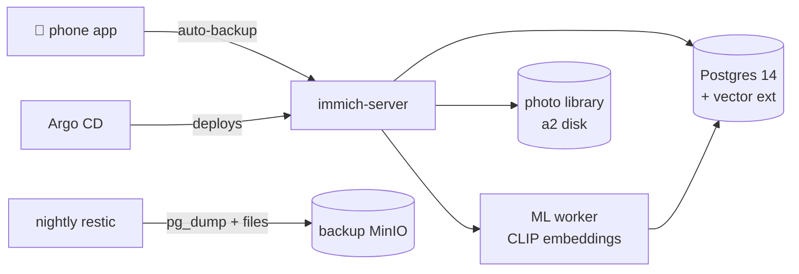

# Immich: Photos That Stay Home

**What it is:** Immich is a self-hosted photo and video platform — automatic phone backup, a timeline, albums, shared links, face recognition, and the party trick: **semantic search**. Type "dog on a beach" and it finds your dog, on a beach, using CLIP embeddings computed by its own machine-learning service.

**Why I recommend it:** photos are the one dataset in this lab that is genuinely irreplaceable. Credentials can be rotated, media can be re-downloaded, and configs live in git, but a photo can't be re-taken. Immich provides a self-hosted alternative to Google Photos, so the archive stays under my control. It is also a fast-moving project, so updates need care.

**See it:**

{/* screenshot: media/immich-timeline.png — photo timeline */}
{/* screenshot: media/immich-search.png — semantic search results for a natural-language query */}

## What I actually use it for

- Automatic photo backup from phones the moment they hit home WiFi
- "Find that photo of the whiteboard from March" — semantic search actually delivers
- Face-grouped albums without ever uploading a face to a cloud
- Sharing an album link on the LAN instead of texting compressed copies

## The interesting configuration bits

Immich is really *four* services in a trenchcoat — server, machine-learning worker, Redis, and its own Postgres — all in [`clusters/home/immich/`](https://github.com/briancaffey/home-lab/tree/main/clusters/home/immich) on a2. The Postgres is special: it runs Immich's own image with **vector extensions** (VectorChord/pgvecto.rs) baked in, because the semantic search lives in the database.

That specialness is exactly why it gets deliberate treatment:

- **Nightly backups do it properly**: the photo library is copied file-level, and the database is captured with `pg_dump` — run from *the same image version the server runs*, so dump and server can never version-skew.
- The ML model cache is explicitly *not* backed up — it re-downloads. The rule of the house: never back up what the internet can restore.

## How it fits the ecosystem

