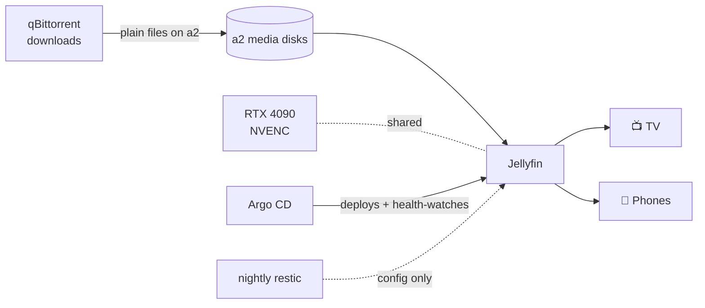

# Jellyfin: The Media Server

**What it is:** Jellyfin is a free, open-source media server — think Plex without the account, the telemetry, or the subscription nags. It scans folders of video and audio, fetches artwork and metadata, and streams to any browser, phone, or TV app in the house.

**Why I recommend it:** it's the piece that turns "files on a disk" into "a living room experience," and it asks for nothing in return. No cloud account. No monthly fee. Your watch history stays in your house. And because mine runs next to a GPU, it transcodes anything to anything without breaking a sweat.

**See it:**

{/* screenshot: media/jellyfin-library.png — library grid view */}
{/* screenshot: media/jellyfin-playback.png — playback with transcode badge */}

## What I actually use it for

- Streaming the media library to the TV and to phones on the LAN (`https://jellyfin.lan`)
- Watching screen recordings and captures straight off a2's disks
- Playing whatever qBittorrent just finished downloading — new files appear in the library without any human filing (see [Downloads](/media/downloads))
- The "Hacker News FM" podcast-to-audio library that other lab services generate

## The interesting configuration bits

Jellyfin lives on **a2**, and that's not an accident — a2 has the media disks *and* an RTX 4090. The deployment sets `runtimeClassName: nvidia` with shared GPU access, so the same card that serves AI models by day does **NVENC hardware transcoding** by night. A 4K remux becomes a phone-friendly stream without touching the CPU. The manifests live in [`clusters/home/jellyfin/`](https://github.com/briancaffey/home-lab/tree/main/clusters/home/jellyfin).

The downloads directory is mounted **read-only** into the container, and in-progress torrents are kept in a dot-directory Jellyfin's scanner ignores — so the library only ever shows finished files.

## How it fits the ecosystem

Media files themselves aren't backed up — they're re-acquirable. The *configuration* (watch states, library settings) rides the nightly backup train like everything else.
