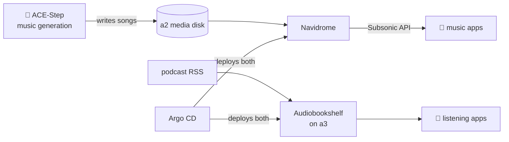

# Navidrome & Audiobookshelf

Two small servers, one idea: **audio you own should stream like audio you rent** — same convenience, none of the catalog roulette.

## Navidrome: the music server

**What it is:** a lightweight streaming server for your own music files. It speaks the **Subsonic API**, which means a whole ecosystem of polished mobile apps (play, cache offline, scrobble) treats your house like Spotify's datacenter.

**Why I recommend it:** streaming services un-license albums; your FLAC collection doesn't. Navidrome is nearly zero-maintenance — point it at a folder, get gapless playback and per-user libraries forever. And it has one delightfully weird job here:

- **It streams AI-generated music.** The lab's music-generation service (an ACE-Step model on a 4090) writes songs to the media disk, and Navidrome serves them like any other album. There is something quietly hilarious about scrobbling a track whose "artist" is a GPU one room away.

**Daily driver bullets:**
- Subsonic apps on phones (`http://192.168.5.96:30533` for clients, `https://music.lan` for the web UI)
- The AI-songs library — generations land on disk, appear in the app
- Offline caching before flights, from my own server, no premium tier

{/* screenshot: media/navidrome-albums.png — album grid incl. AI-generated albums */}

## Audiobookshelf: books and podcasts

**What it is:** a server for audiobooks and podcasts with the features the big apps ration out: per-book progress sync, sleep timers, playback speed, chapter art, and podcast auto-download.

**Why I recommend it:** podcasts are RSS — there was never a reason that required an account with anyone. Audiobookshelf downloads episodes on schedule, keeps position across devices, and does audiobooks properly (a 40-hour book remembers exactly where you fell asleep). It runs quietly on **a3** ([`clusters/home/audiobookshelf/`](https://github.com/briancaffey/home-lab/tree/main/clusters/home/audiobookshelf)) — one of the few media services not on a2, purely for spread.

**Daily driver bullets:**
- Podcast subscriptions auto-downloading on schedule (`https://abs.lan`)
- Audiobook progress that survives switching from phone to browser
- The generated "Hacker News FM" audio feed — another case of the lab producing media for its own shelves

{/* screenshot: media/abs-library.png — audiobook shelf with progress bars */}

## The honest take on both

Neither of these is impressive infrastructure — and that's the recommendation. They're the "boring appliance" tier of self-hosting: deployed once from [`clusters/home/`](https://github.com/briancaffey/home-lab/tree/main/clusters/home), managed by Argo like everything else, updated when Renovate suggests it, and otherwise invisible. If your entire homelab were services like these, you'd never learn anything. If your homelab has *none* of them, it's a science project instead of a household utility. The mix is the point.

