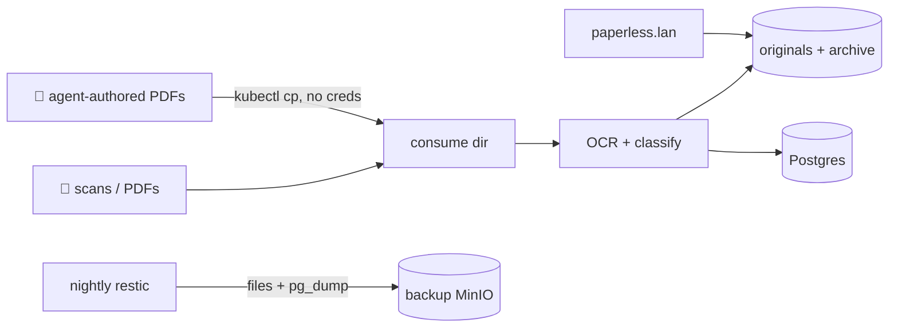

# Paperless-ngx: The Document Brain

**What it is:** Paperless-ngx eats documents — scans, PDFs, receipts, letters, manuals — runs OCR on them, tags and files them, and gives you full-text search over everything you've ever fed it. The physical paper goes in a box (or the shredder); the searchable truth lives here.

**Why I recommend it:** "where is that document" simply stops being a question. Tax forms, appliance manuals, insurance letters — two words in the search box and it's on screen. It's also the rare self-hosted app that gets *better* the lazier you are: drop files in, let the machine do the filing.

**See it:**

{/* screenshot: media/paperless-dashboard.png — dashboard with recent documents */}
{/* screenshot: media/paperless-search.png — full-text search hit with OCR highlight */}

## What I actually use it for

- Filing every PDF that matters: statements, receipts, manuals, contracts
- Full-text search across years of paper ("water heater warranty" → found)
- **Agent-generated reports**: when an AI agent in the lab writes up a piece of work as a PDF, it lands here automatically — the lab documents itself
- Tag-based smart views (taxes by year, per-appliance manuals)

## The interesting configuration bits

The manifests live in [`clusters/home/paperless/`](https://github.com/briancaffey/home-lab/tree/main/clusters/home/paperless) on a2: web server, its own Postgres, Redis for the task queue, and a set of purpose-named volumes — `data`, `media` (the original documents — sacred), `consume`, and `holding`.

The **consume directory is the best design decision in the whole app**: any file that appears there gets ingested, OCR'd, and filed automatically. That means *anything that can write a file can file a document* — no API token, no login, no SDK. The lab's agents use exactly this: render a PDF, drop it in the consume dir via `kubectl cp`, done. Zero credentials handed out, and the ingestion pipeline treats an AI-authored report identically to a scanned tax form.

Nightly backups treat it with respect: the original documents and archive ride file-level backup, and the Postgres database is captured via `pg_dump` — both into the encrypted restic repository. The transient dirs (`consume`, `holding`) are deliberately excluded: they're conveyor belts, not shelves.

## How it fits the ecosystem

