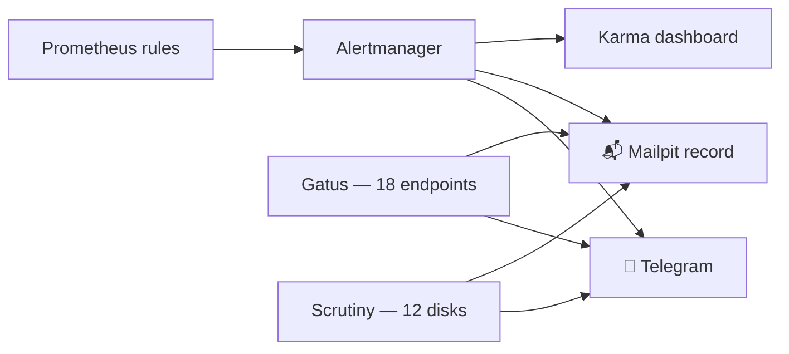

# Alerts That Reach a Human

**What it is:** the pipeline that turns "a metric crossed a line" into "my phone buzzed." Prometheus evaluates the rules, **Alertmanager** groups and routes them, **Telegram** delivers to my pocket, **Mailpit** keeps an always-on paper trail, and **Karma** (`karma.lan`) is the dashboard when I want the full picture with silencing.

**Why it exists — the missing-organ story:** for weeks, this lab had alert *rules* and nowhere to send them. Prometheus dutifully evaluated `VLLMTargetDown` and friends, marked them FIRING… into the void. No Alertmanager existed. The lesson generalizes: monitoring guides love dashboards and skip delivery, and a rule nobody receives is a diary entry, not an alert. Meanwhile the receipts piled up — Jellyfin was once down *three days* and a dev deployment crash-looped for *thirteen* before anything surfaced them.

{/* screenshot: observability/karma.png — karma with a firing test alert */}
{/* screenshot: observability/telegram-alert.png — the phone view, redact chat details */}

**What I get from it daily:**
- 📱 Anything real → Telegram within seconds (node down, disk filling, endpoint dead)
- 🧾 Every alert *and* its resolution → Mailpit, so there's always a record even if I dismissed the buzz
- 🖥️ `karma.lan` for the overview: what's firing, what's grouped, silence a known issue during maintenance
- 🔗 Every alert carries a clickable `prometheus.lan` link straight to the query that fired — tap, see the graph, know the shape of the problem

**The rule pack is earned, not copied.** Each rule traces to a real event: `NodeDown` after five minutes exists because x1 (a laptop node) once ran its battery flat at 5:40am and nobody knew for twelve hours. Disk-almost-full exists because every byte here lives on node-local disks. And the inference fleet gets a deliberately different philosophy — see below.

**"Parked is not down."** Model servers here are constantly scaled to zero to share four GPUs — that's an operational rhythm, not an outage. So *presence* alerts are excluded for the inference fleet entirely; instead, **behavior** rules (KV-cache pressure, requests backing up, slow time-to-first-token) only *can* fire while a model is actively serving, and go silent when it's parked. Zero configuration per service, correct in both directions.

Three emitters share the same two channels: Prometheus/Alertmanager (metrics), **Gatus** (18 endpoint healthchecks — is `jellyfin.lan` actually answering?), and **Scrutiny** (disk health). One phone, one paper trail, whoever noticed first.

Config lives in [`clusters/home/monitoring/`](https://github.com/briancaffey/home-lab/tree/main/clusters/home/monitoring); the Alertmanager config itself is an out-of-band Secret because it touches the Telegram credentials — the one part of this page you won't find in git, on purpose.
