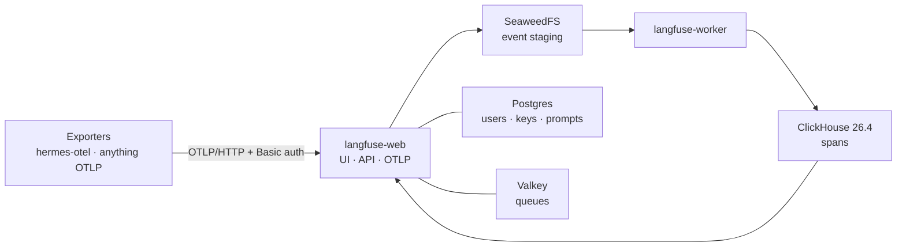

# Langfuse: Where the Agents' Traces Go

**What it is:** [Langfuse](https://langfuse.com) is an LLM engineering platform — traces, prompts, evals — and I run it self-hosted at `langfuse.lan`. When an agent in the lab makes a chain of model calls, Langfuse is where that chain becomes something I can *look at*: which prompt went in, which model answered, how long each step took, what it cost. Anything that speaks OTLP can send traces to it; the first thing that does is [hermes-otel](https://briancaffey.github.io/hermes-otel/backends/langfuse), the tracing shim in front of [Hermes](../ai/hermes.md).

**The quick honest take:** if you're already running Phoenix — and I am — you don't *need* a second tracing backend. I wanted one because Langfuse is what hermes-otel's dashboard adapter speaks natively, because prompt management and evals are things I actually want to try, and because a real self-hosted install of a "v4" product is exactly the kind of thing that teaches you something. It did: it was broken for three days before a single span made it through. That story is below, and it's the most useful part of this page.

{/* screenshot: observability/langfuse-trace.png — a Hermes agentic run as a trace tree, spans expanded */}
{/* screenshot: observability/langfuse-project.png — the hermes-otel project overview */}

## What I use it for

- **Reading an agent's mind after the fact** — a Hermes run is a tree of spans; when it did something odd, the trace says which step decided that
- **Cost and latency per run**, not per model — the gateway's spend page knows totals, Langfuse knows *which conversation* was expensive
- **A queryable read side** — hermes-otel's dashboard pulls spans back out through Langfuse's public API instead of keeping its own store
- **Prompts and evals** (the parts I haven't earned yet — they're why v4 is worth the extra moving parts)

## How it's put together

Langfuse is deployed from the **official Helm chart as a Helm release**, the same way Phoenix is — not through kustomize. Two app Deployments do the work: `langfuse-web` (the UI, the public API, and the OTLP endpoint on one port) and `langfuse-worker` (the ingestion side). Everything stateful sits on a3 on `local-path` volumes:

- **Postgres** (bundled by the chart) — users, projects, API keys, prompts
- **Valkey** (a Redis fork, bundled) — queues between web and worker
- **SeaweedFS** (bundled, S3-compatible) — *every* trace ingest is staged through a bucket here before the worker picks it up
- **ClickHouse** — the analytics store where spans actually live. This one I run myself as a single-node StatefulSet, because the chart's own ClickHouse path wants the upstream ClickHouse operator plus a Keeper cluster, which is a lot of alpha machinery for one box

Ingestion is asynchronous — web writes the event to S3, the worker moves it into ClickHouse — so a span shows up in the UI a few seconds after export, not instantly. Worth knowing before you panic.

**Access:** `https://langfuse.lan` on the LAN (Traefik + the mkcert cert, auto-discovered by Homepage under Observability) and `https://langfuse.<tailnet>.ts.net` from anywhere via the Tailscale operator. Exporters post to `/api/public/otel/v1/traces` with Basic auth (project public key as the user, secret key as the password); in-cluster they can go straight to the `langfuse-web` service in the `observability` namespace and skip TLS.

**First login:** the chart supports a headless bootstrap — on the very first start with an empty database it creates an org, a project, a user, and that project's API keys from `LANGFUSE_INIT_*` environment variables. All of those values come from an in-cluster Secret that never touches git (the [README](https://github.com/briancaffey/home-lab/tree/main/observability/langfuse) shows how to mint and read it). The subtle part: those init values apply *once*, and the app's salt and encryption key must never change after data exists, or every API-key hash stops matching.

Where it all lives: [`observability/langfuse/`](https://github.com/briancaffey/home-lab/tree/main/observability/langfuse) — `values.yaml` for the release, `clickhouse.yaml` for the StatefulSet, `ingress-lan.yaml`, and a `smoke-test.sh` I'll explain in a moment.

:::warning[🔥 War story]
The first install went in on a Friday. By Monday `langfuse-web` had restarted **649 times** and not one span had made it through. Four separate things were wrong, and they hid behind each other.

**1. The liveness probe killed the migrations.** On first boot the web pod runs every Prisma migration before it serves its health endpoint — 438 of them against an empty database, several minutes on a3. The chart's default liveness probe gives it about 50 seconds. It killed the container mid-migration, Prisma recorded that migration as *failed*, and from then on every start refused to touch the database (`Error: P3009`). The fix was three parts: a 10-minute liveness window in the values so it can't happen again, `prisma migrate resolve --rolled-back` for the failed migration, and — the one I'd never have guessed — dropping an *invalid* Postgres index. That migration uses `CREATE INDEX CONCURRENTLY`, which is not transactional, so the kill left a half-built index behind and the re-run died with "already exists."

**2. ClickHouse was too old.** With Postgres unblocked, the ClickHouse migrations ran — and migration 0039 failed with "Only literals can be skip index arguments." Langfuse v4 uses text skip indexes that need ClickHouse 25.12 or newer (26.4 recommended); my StatefulSet was on 25.3. golang-migrate marks its schema *dirty* on failure and refuses to continue, so the fix was an image bump to 26.4.5 plus forcing the version pointer back to the last good migration by hand.

**3. ClickHouse was eating itself.** While chasing the above I noticed the ClickHouse pod OOM-ing. Its own profiler log (`system.trace_log`) had written **4 GB in three days on an idle instance**, and merging those parts blew through the 4 GiB memory limit. Now disabled through a `config.d` override in the StatefulSet's ConfigMap, and the limit is 8 GiB.

**4. The API I was testing against doesn't exist anymore.** Once spans were flowing, my "read one back" check returned 404 — because Langfuse v4 is "events-only": the v3 read endpoints (`/api/public/traces`, `/observations`, `/metrics`) are gone, and `/api/public/v2/observations` is the read side. The spans had been there for an hour; I was asking the wrong door.

The keeper from all this is [`smoke-test.sh`](https://github.com/briancaffey/home-lab/blob/main/observability/langfuse/smoke-test.sh): health → OTLP export with the bootstrap keys → poll the v2 API until the span comes back. It's the check I wish I'd had on day one, and it's what "Langfuse is up" means now. The recovery steps for each failure are written down in the README, because I do not trust myself to remember `migrate resolve` under pressure.
:::

## How it fits with the rest

- **[Hermes](../ai/hermes.md)** traces arrive via hermes-otel, the first and so far the main exporter. Its dashboard also *reads* from Langfuse, so the two are a matched pair.
- **[LiteLLM](../ai/litellm.md)** exports OTLP today to Phoenix; it can just as easily be pointed at Langfuse's OTLP/HTTP endpoint, which would put every gateway call — not just agent runs — in the same trace store. That's the obvious next step once I've decided which of the two backends I want to be the long-term home.
- **Phoenix** stays. Two tracing backends is one more than a home lab needs, and I'll consolidate — but not until I've used both enough to have an opinion instead of a preference.
- **And then there were nine.** Two became nine when every self-hostable backend hermes-otel supports moved in next door — OpenObserve, Jaeger, Tempo, SigNoz, Uptrace, Parseable and an OTel Collector gateway. Langfuse is still one of the two I'd actually open to *read* a trace; the rest are the comparison set, and they have [their own page](./otel-backends.md).
