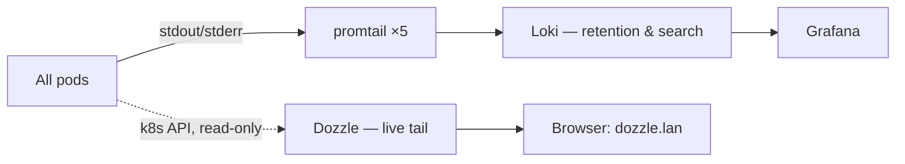

# Logs: Retention vs Tail -f

**What it is:** two complementary log tools. **Loki** (fed by promtail on every node) is the archive — it answers *"what did that pod say last Tuesday at 3am?"* **Dozzle** is the live wire — a web UI that answers *"what is this pod screaming right now?"* with real-time streaming, multi-pod split views, and search.

**Why both:** because they're different questions. Grepping history needs indexing and retention; watching a model server load its weights needs a live stream with zero setup. I tried to pretend one tool could be both. It can't, and the pair is cheaper than the compromise.

{/* screenshot: observability/dozzle-tail.png — dozzle streaming a model load, split view */}

**What I use them for daily:**
- 🔴 **Dozzle** while deploying: watch a pod come up in real time instead of re-running `kubectl logs -f`
- 🕰️ **Loki** (through Grafana) when an alert says something broke overnight and I need the story
- 🧵 Dozzle's split view when two services are talking to each other and I want both sides of the conversation
- 🔍 Watching long operations live — model downloads, backup runs, CI builds — from a phone, in bed

**How it's wired:** promtail is a DaemonSet shipping every container's logs to Loki. Dozzle is a single small pod in **Kubernetes mode** — no agents anywhere; it reads logs through the Kubernetes API using a deliberately tiny, read-only permission set ([`clusters/home/dozzle/`](https://github.com/briancaffey/home-lab/tree/main/clusters/home/dozzle)). And unlike most of my `.lan` tools, Dozzle requires a **login**: pod logs are exactly where stray tokens and connection strings end up, so "it's only my LAN" isn't good enough here. The password hash is bcrypt, because Dozzle itself dropped SHA-256 support in a security advisory — a nice example of an upstream forcing good hygiene.

**When to reach for which:** if the thing is happening *now*, Dozzle. If the thing *happened*, Loki. If you don't know when it happened, start with the alert in Mailpit — it has a timestamp, and that timestamp is a Loki query away from the whole story.
