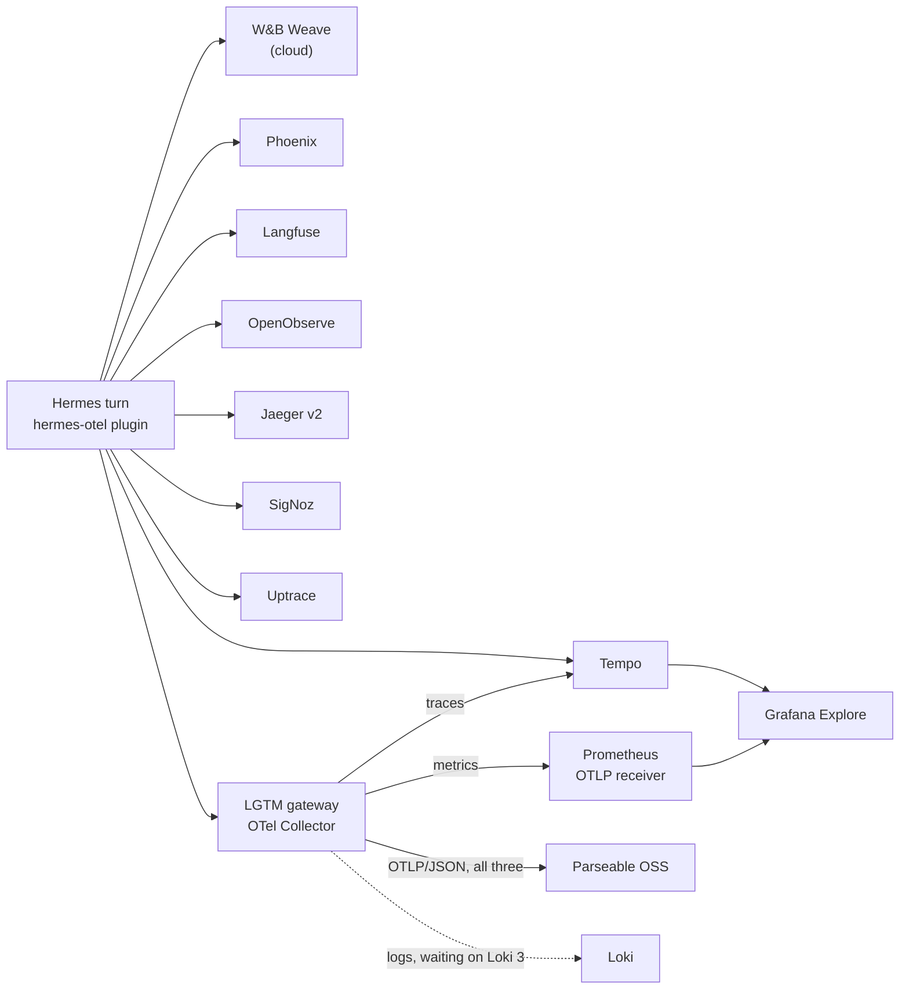

# One Agent Turn, Nine Backends

**What it is:** a shelf of OpenTelemetry backends in the `observability` namespace — OpenObserve, Jaeger, Grafana Tempo, an OTel Collector "LGTM" gateway, Parseable, SigNoz and Uptrace, next to the [Langfuse](./langfuse.md) and Phoenix that were already here. Every one of them comes from its **official Helm chart** as a Helm release with the values committed under [`observability/<name>/`](https://github.com/briancaffey/home-lab/tree/main/observability). And every time [Hermes](../ai/hermes.md) takes a turn, the [hermes-otel](https://github.com/briancaffey/hermes-otel) plugin fans that turn out to *all* of them at once. One agent run, nine copies of the trace, nine UIs to compare.

**The quick honest take:** nobody needs nine tracing backends. I don't either. What I need is for the hermes-otel plugin — which I maintain, and which claims to support these backends — to have been *tested against a real one I can log into*, not against a docs page. That claim is now checked in the most literal way possible: a real `/v1/runs` turn was sent, and the trace showed up in every backend. The side benefit is that I now have an opinion about each of these tools formed by installing it, not by reading its landing page. This page is those opinions plus the gotchas, and the whole shelf is designed to be torn down one `helm uninstall` at a time when the novelty wears off.

{/* screenshot: observability/otel-backends-homepage.png — the Observability group on Homepage with all nine tiles */}
{/* screenshot: observability/otel-backends-same-trace.png — the same Hermes trace open in Jaeger, SigNoz and Uptrace side by side */}

## The matrix

| backend | hermes-otel `type` | traces | metrics | logs | where to look |
|---|---|---|---|---|---|
| Arize Phoenix | `phoenix` | yes | — | — | `phoenix.lan` |
| [Langfuse v4](./langfuse.md) | `langfuse` | yes | — | — | `langfuse.lan` |
| OpenObserve | `openobserve` | yes | yes | yes | `openobserve.lan` |
| Jaeger v2 | `jaeger` | yes | — | — | `jaeger.lan` |
| Grafana Tempo | `tempo` | yes | — | — | Grafana Explore |
| LGTM gateway (OTel Collector) | `lgtm` | yes | yes | waiting on Loki 3 | Grafana |
| SigNoz | `signoz` | yes | yes | yes | `signoz.lan` |
| Uptrace | `uptrace` | yes | yes | yes | `uptrace.lan` |
| Parseable OSS | via the gateway | yes | yes | yes | `parseable.lan` |

The seven new ones share one recipe: pinned to **a2** (the node with headroom), `local-path` PVCs, a `<name>.lan` Traefik ingress with the mkcert cert, a Homepage tile, and any credential delivered by External Secrets from a Vaultwarden item — nothing sensitive in git. Chart versions, endpoints and the exact deploy/teardown commands live in each backend's README under [`observability/`](https://github.com/briancaffey/home-lab/tree/main/observability); the top-level [`observability/README.md`](https://github.com/briancaffey/home-lab/blob/main/observability/README.md) is the canonical version of the table above.

Each backend gets its own export queue in the plugin, so the fan-out is non-blocking: a backend that is scaled down or uninstalled costs a few dropped-batch log lines and nothing else. The list itself is a ConfigMap in [`clusters/home/hermes/`](https://github.com/briancaffey/home-lab/tree/main/clusters/home/hermes) — comment a backend out, push, and Hermes stops sending to it.

## The backends, one honest paragraph each

**OpenObserve** is the lightest thing on the shelf that takes all three signals: one pod, embedded SQLite for metadata, parquet on a PVC. If I had to keep exactly one of the new ones for a small lab, it would probably be this. Basic auth on the OTLP endpoint, 14-day retention, and a password policy that rejected my first attempt at an admin password.

**Jaeger v2** is now a single binary built on the OpenTelemetry Collector, and the official chart reflects that: storage is configured through a v2 `userconfig` block rather than chart flags. The chart's default is in-memory, so my values swap in Badger on a PVC with a 7-day span TTL. Two things worth knowing: the chart mounts the config with `subPath`, so a values change does *not* reach a running pod until you restart the Deployment; and the query API moved to `/api/v3/…` — the v1 `/api/services` path that every tutorial uses is a 404 now.

**Grafana Tempo** has no UI of its own; it is a trace store that Grafana reads, so the change here was as much a Grafana datasource as a Helm release. The chart gotcha is about *where the chart lives*: the Grafana community charts moved to `grafana-community.github.io` in January 2026, and `grafana/tempo` on the old repo is a stale 1.24.x. Traces arrive twice — directly from the plugin's `tempo` backend and via the gateway's `lgtm` backend — which was the point: it proves both paths.

**The LGTM gateway** is the one that isn't really a backend. hermes-otel's `lgtm` type means "an OTLP receiver with Grafana behind it," which on a laptop is the `grafana/otel-lgtm` demo container — no chart, no durable storage, explicitly not something to port. So the k3s stand-in is an **OpenTelemetry Collector** (contrib image, official chart) that receives on `:4318` and fans out to the real pieces: traces to Tempo, metrics to Prometheus (which needed the `--web.enable-otlp-receiver` flag), and all three signals re-encoded to OTLP/JSON for Parseable. Logs are the gap: the lab's Loki is 2.9 with no OTLP endpoint, and collector-contrib has dropped its `loki` exporter, so the logs pipeline goes to the `debug` exporter until the [Loki 3 migration](./logs.md) lands.

**Parseable OSS** is the reason the gateway grew a JSON leg. hermes-otel has a `parseable` type that authenticates with an API key — which is a Parseable Cloud/Enterprise feature; OSS has no `/api/v1/apikeys` and returns 401 to any request carrying the header. And OSS answers `400 Protobuf ingestion is not supported` to OTLP/protobuf, which is all the Python exporter sends. So the plugin does not talk to Parseable directly at all: the collector re-encodes to JSON, adds Basic auth and the per-signal `X-P-Stream` header, and Parseable's `hermes-traces` / `hermes-metrics` / `hermes-logs` datasets appear on first ingest.

**SigNoz** is the heaviest of the new arrivals — roughly 2–3 GB of RAM idle — because the chart brings its own ClickHouse via a bundled Altinity operator (cluster-scoped, be aware), a ZooKeeper, its own OTel collector and a schema-migrator Job. First start is a few minutes of dominoes. The gotcha that cost me the most time is below in the war story: until the first admin user and org exist, the collector accepts nothing.

**Uptrace** 2.0 ships as an app-only chart whose bundled stores are *operator CRs* — an Altinity `ClickHouseInstallation`, a CloudNativePG `Cluster`, an `OpenTelemetryCollector`. Three operators for one dev backend is too much, so all three are disabled and the stores are two plain StatefulSets (ClickHouse 25.3 and Postgres 17) plus the shared platform Redis. Every credential in the values file is a `${VAR}` that Uptrace expands from its environment, which is exactly the shape External Secrets is good at. It logs one seed-fixture error on every restart (re-applying seed data over an existing org) and then carries on; ignore it.

:::warning[🔥 War story]
**The backends list that wasn't being read.** After the seventh backend was up and every OTLP endpoint had returned a 200 to a hand-built smoke request, I sent a real Hermes turn — and the traces went to *Langfuse Cloud*. Not to any of the nine backends in my config. The plugin was running; it just wasn't reading my file.

The install step seeded the plugin config to `/opt/data/.hermes/plugins/hermes_otel/`, which is where the old fork branch had looked. The 1.x plugin, with `HERMES_HOME=/opt/data`, looks in `/opt/data/plugins/hermes_otel/` (which the init container wipes and reinstalls on every boot) or at `/opt/data/hermes_otel.yaml`. Neither existed, so the plugin fell through to its env-var auto-detection, found a Langfuse-shaped pair of keys in the pod's environment, and helpfully configured itself for Langfuse *Cloud*. Every "ingest OK" I had seen was the plugin working perfectly with a config I hadn't written.

The fix is the boring one: the ConfigMap is mounted at `/etc/hermes-otel/` and `HERMES_OTEL_CONFIG` — the plugin's highest-precedence path — points straight at it. No seeded copy on the volume, nothing for a reboot to wipe, and a config change is a git push (Reloader rolls the pod). Two lessons I keep writing down in different words: **"the endpoint answered 200" tests the backend, not the sender**, and a plugin with helpful auto-detection will find *something* to do when your explicit config is silently ignored.

**The collector that accepted nothing.** SigNoz came up green — every pod Running — and port 4318 on its collector was closed. The collector registers with the SigNoz app over OpAMP on start, and that registration fails (`failed to find or create agent`) until a first user and org exist in the app. Register the admin via the API (or the UI's first-run page), and the collector opens its ports a moment later. The order is *register, then ingest*, and nothing in the chart tells you that.
:::

## What is deliberately not here

- **The SaaS-only hermes-otel backends** — LangSmith, Honeycomb, telemetry.dev, and W&B Weave — are not self-hostable and are not mimicked. Weave stays configured as a cloud backend in the same fan-out, so the plugin's cloud path is exercised alongside the in-cluster ones.
- **Argo CD does not manage these releases.** Like Phoenix and Langfuse they are `helm upgrade --install` from a laptop, with values in git; a dev shelf that gets torn down and rebuilt doesn't need a controller fighting for it. The parts that *are* Argo-managed — the Hermes config, the External Secrets, the Prometheus flag, the Grafana datasource — only take effect after a push.
- **High availability, replicated storage, anything production-shaped.** Single node, single replica, `local-path`. These exist to be looked at, not depended on.

## How it fits with the rest

- **[Hermes](../ai/hermes.md)** is the only sender today. The plugin is installed from a pinned hermes-otel release tag on every boot, so "which version of the plugin is Hermes running" is one line in the deployment.
- **[Langfuse](./langfuse.md)** and Phoenix keep their own pages and their own reasons to exist; they're the two I'd actually reach for to read a trace. The rest are the comparison set.
- **[Prometheus & Grafana](./prometheus-grafana.md)** gained an OTLP receiver and a Tempo datasource, so a Hermes trace is one TraceQL query away in the same Grafana I already live in.
- **[Logs](./logs.md)** are the unfinished edge: the gateway's log pipeline is waiting on Loki 3.
