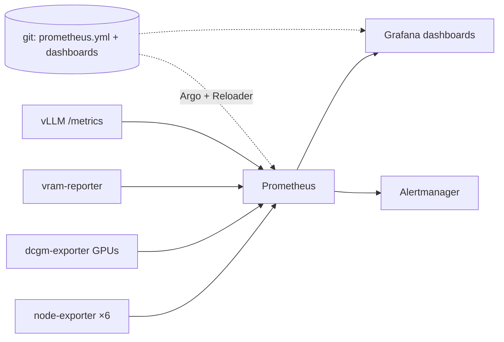

# Prometheus & Grafana, Hand-Rolled on Purpose

**What it is:** Prometheus scrapes numbers from everything in the lab every five seconds — CPU, disk, GPU temperatures, how many tokens per second a model is generating — and Grafana turns those numbers into dashboards I actually look at. This is the memory of the cluster: when something feels slow, this is where "feels" becomes "is."

**Why I run it this way:** most Kubernetes guides push you toward the Prometheus *Operator* — a system that generates your monitoring config from custom resources scattered across every namespace. It's powerful, and for a company it's right. For a learning lab it has one fatal flaw: **you can't read it**. My setup is a single `prometheus.yml` with plain `static_configs` and a folder of dashboard JSON files, all living in [`clusters/home/monitoring/`](https://github.com/briancaffey/home-lab/tree/main/clusters/home/monitoring). When I want to know what's being scraped, I read one file. When an agent needs to add a scrape target, it edits one file. That legibility is worth more to me than dynamic discovery.

{/* screenshot: observability/grafana-gpu.png — the GPU fleet dashboard, dark mode */}
{/* screenshot: observability/grafana-nodes.png — node overview */}

**What I use it for daily:**
- 📈 The **GPU fleet dashboard** — which 4090 is busy, how hot, how much VRAM each pod holds (via a tiny custom exporter called `vram-reporter`, because shared GPUs are invisible to the scheduler)
- 🌡️ Node health at a glance — six machines, one row each
- 🚀 vLLM serving metrics — tokens/sec, time-to-first-token, KV-cache pressure when a model is loaded
- 📶 WAN speed history (a speedtest exporter feeds a dashboard that settles arguments with the ISP)
- 🧾 The raw query console at `prometheus.lan` when an alert links me straight to the expression that fired

**How it's wired, minus the boring parts:** node-exporter runs on all six machines; dcgm-exporter reads the NVIDIA GPUs; vLLM servers expose `/metrics` natively. Dashboards are *file-provisioned* — JSON in git, mounted into Grafana — so the repo is the source of truth for what dashboards exist. Retention is 15 days, which is plenty for "when did this start?"

**The tax on legibility:** the flip side of hand-rolled `static_configs` is that a new node is a manual edit, not a discovery. When t430 joined, its node-exporter DaemonSet started running instantly, but Prometheus wouldn't scrape it until I added the target to `prometheus.yml` by hand — and its temperature row stayed blank until I added its IP to the node-label mapping baked into the fleet dashboard JSON. An Operator would have found the node on its own. I still take the trade: I'd rather edit one readable file per node than run a system I can't read the rest of the time. But it's an honest cost, and it's exactly the kind of step that's easy to forget when a node "just works" after joining.

The one genuinely tricky bit: config files live in ConfigMaps with **stable names** (no content-hash suffixes), which used to mean editing a dashboard required manually restarting Grafana. That era ended when [Reloader](https://github.com/briancaffey/home-lab/tree/main/clusters/home/reloader) joined the cluster — now a config commit rolls the right pods automatically, and the whole loop (edit JSON → push → Argo syncs → Reloader restarts → dashboard live) involves zero kubectl.

