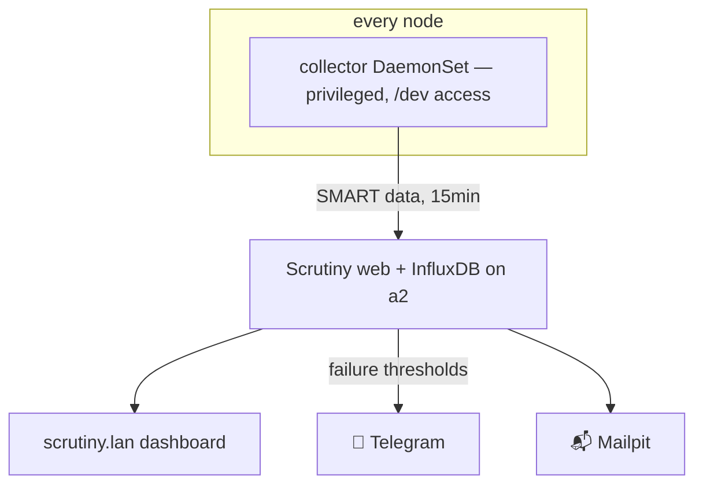

# Scrutiny: Watching the Disks Age

**What it is:** Scrutiny reads the S.M.A.R.T. health data every hard drive and SSD quietly maintains about itself — reallocated sectors, temperature history, hours on the clock — and turns it into a dashboard (`scrutiny.lan`) plus alerts when a drive starts telling you it's dying.

**Why it's existential here, not nice-to-have:** this cluster's storage is deliberately boring — node-local disks, no replication, protected by nightly backups. That design has exactly one hard requirement: **you must find out a disk is failing *before* it fails.** A dying disk caught early is a calm weekend of `rsync` and a shopping trip. A dead disk discovered at mount-time is a restore drill under adrenaline. Scrutiny is the difference, and at the price of one small DaemonSet it's the cheapest insurance in the lab.

{/* screenshot: observability/scrutiny-dashboard.png — 12 drives, all green */}
{/* screenshot: observability/scrutiny-drive-detail.png — temp history on one of a2's HDDs */}

**What I use it for:**
- 💚 A weekly glance at `scrutiny.lan`: twelve drives across five machines, ideally all green
- 🌡️ Temperature history when a node's placement or workload changes (is that HDD running hot since the backup job moved in?)
- 📉 SMART attribute trends with failure-rate context — Scrutiny shows how *drives like yours* fared at these values, not just raw numbers
- 📱 Doing nothing, mostly: a failure-threshold alert goes to Telegram and Mailpit on its own; quiet is the feature

**How it's wired:** hub-and-spoke, in [`clusters/home/scrutiny/`](https://github.com/briancaffey/home-lab/tree/main/clusters/home/scrutiny). The hub (web UI + a small InfluxDB for history) lives on a2. The spokes are a collector DaemonSet on **every node** — and these collectors are, proudly, **the only privileged workload in the whole cluster**. Reading raw SMART data requires talking to `/dev` directly; that's the actual job, so the privilege is honest. Collectors report every 15 minutes; notifications ride the same Telegram + Mailpit channels as everything else.

The inventory it watches tells the lab's story in hardware: a2's NVMe pair plus the big HDDs (including the 6TB where the backups live — the disk watching the disk that guards the others), a3's media drives, a1's mixed bag, and the NVMe in the laptop and the Spark. There's even a phantom: Longhorn's iSCSI volume shows up as an `IET VIRTUAL-DISK`, a "drive" that's actually a replicated volume wearing a trench coat — ignorable, but a fun reminder that block devices are a social construct.

