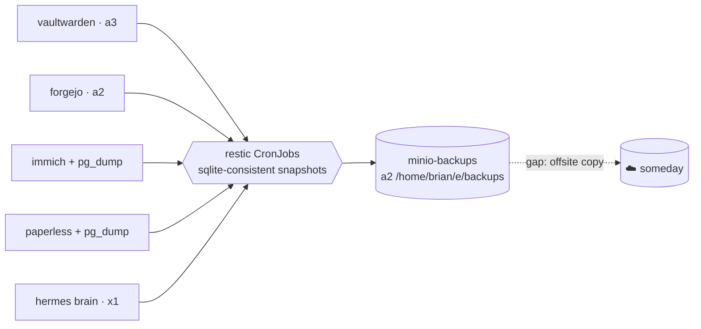

# Backups: An Untested Backup Is a Rumor

**What it is.** A set of nightly [restic](https://restic.net/) jobs that copy everything irreplaceable in the cluster to a dedicated MinIO (S3-compatible) store on a2's big 5.5 TB disk. Encrypted, deduplicated, retention-managed — and, crucially, **restore-drilled**.

**Why I need it.** My storage philosophy is deliberately boring: node-local disks, no replication. That's only defensible if backups are real. The doctrine here has two lines: *replicate for mobility, back up for safety* — and *an untested backup is a rumor*. The day this system went live, it didn't count as done until a backup had been decrypted, restored, and read back.

**The first principle: only back up what the internet can't restore.**

| Backed up nightly | Deliberately not backed up |
|---|---|
| Vaultwarden's credential DB (03:00) | Container images (Harbor re-pulls them) |
| Forgejo — every repo AND every issue (03:20) | AI model weights (re-downloadable) |
| Immich photos + its Postgres dump (03:40) | Proxy caches |
| Paperless documents + data + Postgres dump (04:00) | Torrent downloads |
| Hermes' brain — SOUL.md, skills, memory (04:20) | Anything an initContainer re-derives |

**How it's wired:**

**Details that earn their keep:**

- **Never share a node with what you protect.** The backup MinIO lives on a2's disk — a *different node and spindle* from Vaultwarden (a3) and Hermes (x1). It's a separate instance from the platform MinIO, on purpose.
- **SQLite gets consistent snapshots**, not raw file copies — a live WAL database copied naively can be torn. Postgres databases get proper `pg_dump`s with version-matched clients.
- **Retention:** 14 daily + 8 weekly snapshots, pruned in-run, with a 10% read-back integrity check every night.
- **The escrow circularity:** the restic encryption password lives in Vaultwarden *and* the macOS Keychain — because a password stored only inside Vaultwarden can never decrypt Vaultwarden's own backup. Think about that one for a second; it's the kind of trap you only catch by walking the recovery path in your head.

**The restore drill.** A throwaway pod restored Vaultwarden's latest snapshot, decrypted it, and read the database: `integrity_check: ok`, 2 users, 25 ciphers, 1 organization. That moment — not the first successful backup — is when this page earned its title.

**The honest gap:** every snapshot currently lives in the same house as the originals. An offsite copy (a second restic repo on B2/S3 or a friend's box) is the known missing tier, tracked and waiting on a destination decision.
