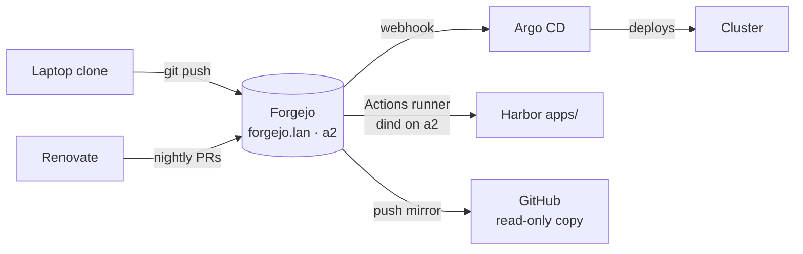

# Forgejo: Git at Home

**What it is.** Forgejo is a self-hosted Git forge — think GitHub, but a single lightweight service on your own hardware. Repos, issues, pull requests, webhooks, and a built-in CI system (Actions, workflow-compatible with GitHub's). Mine runs on a2 at `https://forgejo.lan`.

**Why I need it.** This is the **operative remote** for the entire lab: Argo CD clones its desired state from here, Renovate opens its dependency PRs here, CI runs here, and merging a PR here is — literally — how software gets deployed to my cluster. GitHub still exists in the picture, but as a read-only mirror. The center of gravity is in the house.

**See it.**

{/* screenshot: platform/forgejo-repo.png — the home-lab repo with PRs tab showing renovate PRs */}
{/* screenshot: platform/forgejo-issue-43.png — the GitOps rollout tracker issue as ops logbook */}

**What it does daily:**

- **Serves the truth**: Argo CD reads `brian/home-lab` from here and makes the cluster match it
- **Receives robot PRs**: Renovate's nightly dependency proposals land here, wearing risk-tier labels
- **Runs CI**: the Actions runner (Docker-in-Docker on a2) builds app images and pushes them to Harbor
- **Keeps the ops logbook**: issues here aren't just TODOs — the GitOps rollout tracker is a task-by-task diary of how the lab evolved, with evidence links in every comment. Future me thanks past me constantly
- **Mirrors to GitHub**: a push mirror forwards `main` automatically, so the repo lives in three places (Forgejo, GitHub, my laptop) — that's the real disaster answer for the code itself

**The shape of it:**

**The self-referential thrill:** Forgejo is itself deployed by Argo CD — which reads its instructions *from Forgejo*. The loop even proved itself: the sync that brought Forgejo under management was Argo cloning from Forgejo to learn it should manage Forgejo. This is exactly as dizzying as it sounds, which is why the automation keeps its hands off Forgejo unless a human has committed a change ([selfHeal is off](../gitops/the-trio.md)), and why a break-glass runbook was written *before* the migration.
