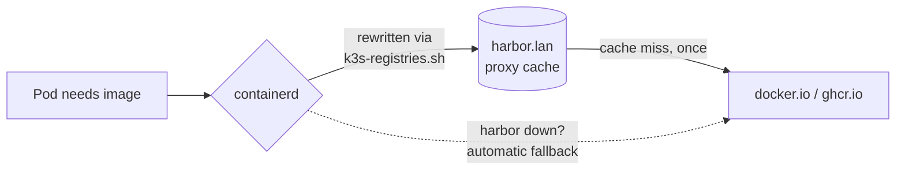

# Harbor: The Registry in the Middle

**What it is.** Harbor is a full-featured private container registry — projects, access control, a web UI, and a built-in Trivy vulnerability scanner. Mine runs on a2 at `https://harbor.lan` and sits *in the middle* of every image pull in the cluster.

**Why I recommend it.** Two reasons that only became obvious after living without it. First: my cluster is WiFi-only, and multi-gigabyte images were being pulled from the internet *once per node*. Harbor's **pull-through proxy cache** means the internet is hit once; every node after that pulls at LAN speed. Second: once you build your own images (and a CI pipeline will make sure you do), they need somewhere to live that isn't a public registry.

**See it.**

{/* screenshot: platform/harbor-projects.png — project list: apps, library, dockerhub, ghcr */}

**What it does for me daily:**

- Every `docker.io` and `ghcr.io` pull in the cluster is silently rewritten through the `dockerhub/` and `ghcr/` proxy projects — first pull fills the cache, the rest are LAN-fast
- Hosts self-built images in `apps/` (CI-built, like rampart) and `library/` (hand-pushed)
- **Auto-scans every pushed image with Trivy** — each artifact carries a vulnerability report in the UI
- Falls back to upstream automatically if Harbor itself is down: it's a cache, not a new single point of failure

**The pull path:**

**The tricky config bit:** Harbor's Helm chart regenerates four internal secrets on *every render*, which would make a GitOps controller fight it forever. Under Argo CD it runs with surgically-mapped `ignoreDifferences` so syncs never rotate its trust tokens — the empirical double-render diff that found those fields is one of my favorite pieces of detective work in the repo. Details in [The Circularity Trio](../gitops/the-trio.md).
