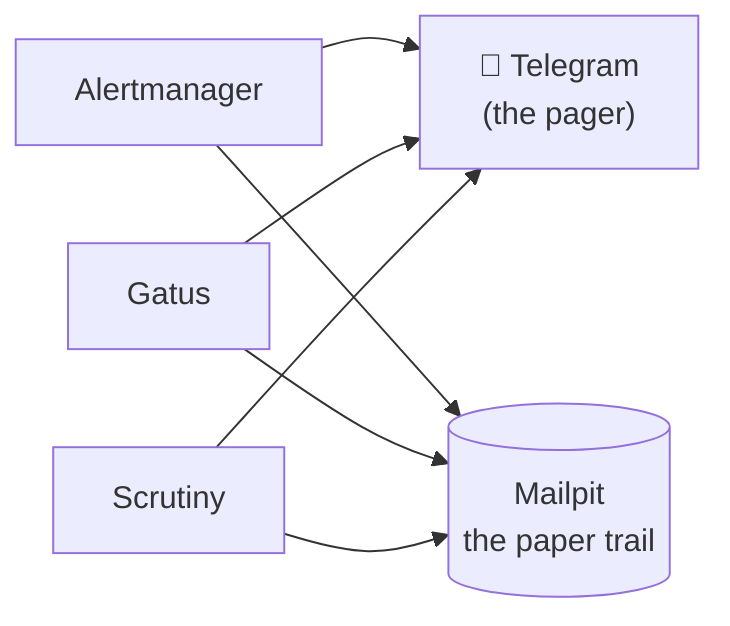

# Mailpit: The Inbox for Robots

**What it is.** Mailpit is a fake mail server with a real inbox. It accepts SMTP from anything on port 1025 — no auth, no TLS required — and instead of delivering the mail anywhere, it shows it in a clean web UI at `https://mailpit.lan`. Think of it as `/dev/null` with a viewing window.

**Why I recommend it.** Every service eventually wants to send email — alerts, password resets, digest reports — and wiring real email (Gmail app passwords, SES, deliverability) is friction you don't want while building. Mailpit removes the question entirely: point *everything* at the sink, see every message instantly, and keep a one-line migration path to real email for the day it matters. In this lab it graduated from test tool to a load-bearing role: **the permanent backup channel for every alert**.

**See it.**

{/* screenshot: platform/mailpit-inbox.png — inbox showing alertmanager FIRING mails and a scrutiny disk alert */}

**What lands in it daily:**

- **Alertmanager** notifications — every firing and resolved alert, as a searchable paper trail while Telegram does the actual paging
- **Gatus** endpoint-outage mails (18 healthchecks) and **Scrutiny** disk-health warnings — same dual-channel pattern
- Test mail from anything I'm configuring — the first thing I do with a new service that "supports email" is point it here and press send

**Where it sits in the alerting picture:**

**The philosophy bit:** a pager and a paper trail want different tools. Telegram interrupts me — that's its job — but messages scroll away. Mailpit keeps a calm, complete, searchable record of everything that ever fired, timestamped, with full headers. When I'm debugging "did that alert actually send at 3 AM?", the inbox answers in seconds.

**Trivia with sentimental value:** Mailpit was the first service to join the GitOps tranche, and the end-to-end proof that Argo CD worked was a label — `home-lab/delivered-by: gitops` — appearing on Mailpit's Service after nothing but a `git push`. The robot inbox was also the GitOps guinea pig.

**The one-line future:** when real outbound email matters someday, every service's SMTP setting changes from `mailpit-smtp...:1025` to a real provider — the sink taught everything to speak SMTP, so the migration is configuration, not surgery.
