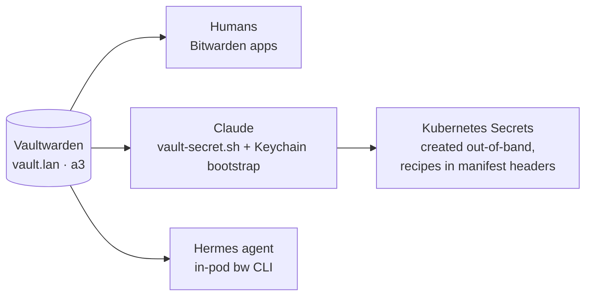

# Vaultwarden: The One Secrets Store

**What it is.** Vaultwarden is a lightweight, self-hosted server that speaks the Bitwarden protocol — so every official Bitwarden app, browser extension, and CLI works against it, but the data lives on my hardware. In this lab it runs on node a3 and serves `https://vault.lan`.

**Why I recommend it.** A home lab generates credentials at an alarming rate: admin passwords, API tokens, robot accounts, bot tokens, encryption keys. Without one place for them, they end up in shell history, sticky notes, and gitignored files you'll eventually lose. Vaultwarden gave my lab a single secrets story — and the surprising payoff was that it made the lab **operable by AI agents**, because an agent with vault access can fetch any credential the moment a task needs it, instead of stopping to ask me.

**See it.**

{/* screenshot: platform/vaultwarden-vault.png — the web vault, Automation collection visible, values redacted */}

**What flows through it daily:**

- My own logins, via the normal Bitwarden apps on phone and laptop
- Every agent credential fetch: `scripts/vault-secret.sh <item>` pulls a value in-memory and pipes it straight into the command that needs it — nothing is ever written to disk
- Every Kubernetes secret: they're created *out-of-band* from vault values, and each manifest documents its own recreate recipe in a header comment, so a lost cluster can re-mint every secret from the vault
- The Hermes agent's in-pod `vault-secret` hand — yes, the *other* AI in the house has vault access too

**How it's wired:**

**The tricky part I actually hit:** giving an *agent* access safely. The answer was a dedicated bot account scoped to one collection, bootstrap credentials in the macOS Keychain, and strict item-naming rules — the full story (including the substring-matching trap that once broke everything named `forgejo…`) lives in [The Trust Fabric](../tissue/trust-fabric.md).

**The stakes, honestly stated:** the entire vault is a **760 KB SQLite file**. It is the most precious 760 KB in the cluster — lose it and every other recovery procedure dies with it. Which is why it's the first target of the nightly [backup system](./backups.md), and the one whose restore has actually been drilled: decrypt, `integrity_check: ok`, every credential readable.
