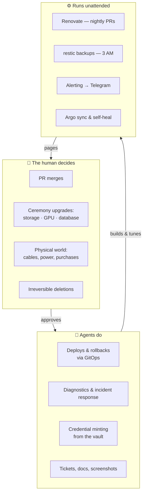

# The Delegation Ladder

**What it is:** this lab is operated *by* an AI agent *with* a human, and the architecture is honest about it. Every kind of work sits on a rung of a ladder: things only I decide, things agents do, and things that run unattended with nobody watching at all. The interesting engineering isn't on any single rung — it's in the guardrails between them.

**Why it matters to a newcomer:** if you're wondering what "AI-operated infrastructure" actually looks like in practice, it is not "the AI does everything." It's a deliberate contract, and this page is that contract written down.

## The top rung: what the human decides

Merging a pull request is the lab's fundamental act of consent — nothing deploys without it. Beyond that, three classes of change are gated so they can *never* arrive looking routine, each gate named after the incident that taught us:

- **`storage-ceremony`** — the storage layer's upgrades are ordered and one-way; a bad one doesn't break a dashboard, it breaks *volumes*.
- **`gpu-ceremony`** — a GPU plumbing bump once shipped two breaking changes inside an innocent-looking version diff and took three fixes to land.
- **`db-ceremony`** — a Postgres major-version bump merged like any other PR and took the photo database down in ninety seconds, because database data directories don't cross majors.

These gates live in the update bot's config: risky updates require a deliberate checkbox before the PR even *exists*. The human also owns everything physical (a laptop node once died overnight because its power cable was unplugged — no amount of YAML fixes that) and every irreversible deletion.

## The middle rung: what agents do

Everything reversible. Deploys ride GitOps, so an agent shipping a change is really an agent making a commit — auditable, revertable, boring. But the rung earns its keep during incidents:

## The bottom rung: what runs while everyone sleeps

The nightly shift: the update bot proposes PRs at 6 AM; encrypted backups run at 3; alerts route to Telegram with a paper-trail copy in the mail sink; the GitOps controller heals drift continuously. The design rule for this rung: unattended things may **propose and protect**, never *decide* — the backups can't delete data, the update bot can't merge, self-heal is switched off for exactly the services the automation itself depends on.

## The honest part

The ladder isn't a limitation of the AI — it's the *product*. Every gate encodes a real scar; every rung boundary is a place where we asked "what's the worst thing that happens if this goes wrong unattended?" and put the decision where the blast radius said it belonged.
