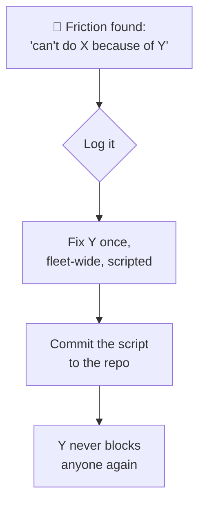

# The Red Tape Doctrine

**What it is:** "red tape" is my name for every moment an operator — human or AI — says *"I can't do X because of Y."* A sudo prompt. An untrusted TLS certificate. A credential that exists only in someone's head. A config that only works on one laptop. Individually each one costs thirty seconds; together they're death by a thousand cuts. One week, I ran a dedicated sprint to kill them all.

**Why it matters:** each piece of red tape is a place where automation dies. An agent that hits a password prompt doesn't slow down — it *stops*. The sprint's insight was that the friction list for agents and the friction list for humans are the same list, and clearing it once clears it for everyone.

## The doctrine, distilled

Everything got the same treatment: find the friction, fix it *everywhere at once*, encode the fix as an idempotent script in the repo so it survives rebuilds. The sprint's greatest hits:

- **Passwordless sudo** on every node (`scripts/node-sudoers.sh`). SSH was already key-only, so a `NOPASSWD` drop-in changed no real security boundary — it just meant node operations could finally run unattended.
- **Trust everywhere** (`scripts/trust-lan-ca.sh`): the internal certificate authority installed into every node's OS trust store, plus split DNS so every machine resolves the lab's `.lan` names. Before this, only the laptop could talk to services properly — the laptop was a single point of failure made of trust.
- **Vault completeness:** every credential actually *in* the vault ([trust fabric](/tissue/trust-fabric)), so "the password is somewhere" stopped being a category of blocker.
- **Node hygiene** (`scripts/node-powersave.sh`): no sleeping, no lid-closing accidents, no WiFi power-save. This one paid for itself immediately — one node's WiFi power-save was **on**, which explained months of it mysteriously dropping off the network.
- **Backups** ([the full story](/platform/backups)) — because the deepest red tape of all is "we can't try that, we might lose data."

## The north-star test

The sprint had an acceptance test, and I still measure changes against it:

> A fresh machine — with only this repo, the vault, and SSH keys — can reach every `.lan` service with valid TLS, run node operations unattended, mint or rotate any credential, and rebuild the operator toolchain in under 30 minutes.

That sentence quietly encodes the whole philosophy: the *laptop* is not the operator. The *repo plus the vault* is the operator. Any machine — or any agent — holding those two things can run this lab.

## What it changed, honestly

Before the sprint, working on the lab meant carrying a mental map of which machine trusted what, which password lived where, and which node would fall asleep mid-task. After it, the lab became the kind of system where an AI agent can pick up a ticket at midnight and finish it — because nothing between the ticket and the fix asks a question only a human at a keyboard can answer.
