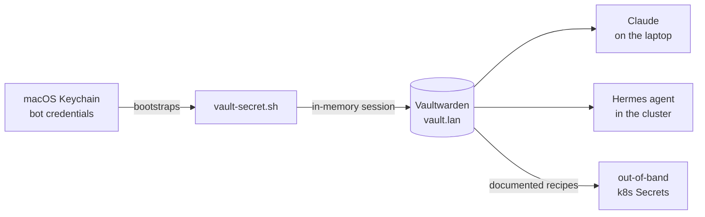

# The Trust Fabric

**What it is:** every credential in this lab — API tokens, admin passwords, bot keys, the works — lives in one place: a self-hosted [Vaultwarden](/platform/vaultwarden) instance. One script reads from it. One script writes to it. Nothing else is allowed to be a source of truth.

**Why I need it:** a home lab quietly accumulates dozens of passwords, and the default fate of each one is to end up in a shell history, a sticky note, or — worst of all — a public git repo. But there's a second reason that turned out to matter more: **an AI agent helps operate this lab**, and an agent can't do real work if every task ends with "and then I stopped, because I didn't have the password." The trust fabric is what turned my agent from a YAML generator into an operator.

{/* screenshot: vaultwarden/collection.png — the Automation collection item list (names only, no values) */}

## How it works

The pieces, in the order they earn their keep:

- **`scripts/vault-secret.sh <item> [field]`** fetches exactly one secret and prints it to stdout. It logs in with a dedicated *bot account* whose credentials live in the macOS Keychain, unlocks the vault into an in-memory session, fetches, and exits. Nothing secret ever touches disk. Its sibling `vault-put.sh` writes the same way — values arrive on stdin, never as command arguments.
- **The bot account** can only see one collection (`Automation`) — never my personal vault. Giving an agent the keys to the lab did not mean giving it the keys to my life.
- **Kubernetes Secrets are "out of band" but never out of *record*:** every manifest that needs a Secret documents the exact recreate command in its header, always reading values from the vault. Lose the cluster, keep the vault, and every Secret regenerates from a copy-paste.

## The part where the agent got hands

The turning point was deciding that Claude — and later [Hermes](/ai/hermes), the in-cluster agent — should fetch credentials *themselves*. Hermes runs the Bitwarden CLI inside its pod with the same bot account, wrapped in a skill whose ground rules are strict: fetch at time of use, never print a full secret, prove access with metadata (a length, a prefix, an HTTP 200) instead of the value.

Once that worked, whole categories of chores collapsed: minting a Forgejo token, rotating a Harbor password, wiring a new service's admin credential — all became "one command, straight from the vault," whether a human or an agent was typing.

## The escrow subtlety

One credential deliberately lives in *two* places. The restic backup password sits in Vaultwarden **and** in the macOS Keychain — because Vaultwarden itself is one of the things being backed up, and a decryption key stored only inside the box it decrypts is a riddle, not an escrow. Circular dependencies get broken on purpose here, and [the backup page](/platform/backups) tells the rest of that story.

## What I actually do with it, daily

- Fetch any service credential in one line — `scripts/vault-secret.sh grafana-admin` — without leaving the terminal
- Let agents mint, store, and use tokens (Forgejo, Harbor, Telegram, HuggingFace…) without ever pasting a secret into a chat
- Regenerate any Kubernetes Secret from the recipe in its manifest header
- Sleep, knowing the public repo contains **zero** secrets — the pre-commit leak scan checks anyway
