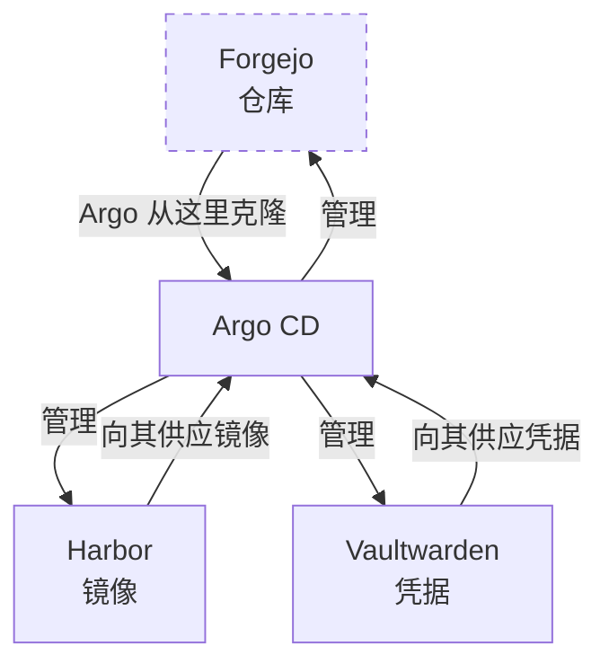

先说实在话：我的 GitOps 迁移中最有意思的问题不是任何单个服务——而是 GitOps 机器本身立足的那三个服务。我的 Git 锻造场（Argo 从那里读取指令）、我的容器镜像仓库（每次镜像拉取都流经它）、我的密码保险库（每条凭据都从它引导出来）。把这三样交给自动化管理，你就造出了一个环：负责修理东西的系统，依赖着它正在修理的东西。

<!-- truncate -->

## 把这个环说白了

Argo CD 的工作方式是克隆一个 Git 仓库，然后让集群向它看齐。我的仓库放在 **Forgejo** 上——而 Forgejo 就跑*在 Argo 管理的这个集群里*。如果一次糟糕的提交弄坏了 Forgejo，Argo 就再也读不到那个装着修复方案的仓库了。修理说明书被锁在了坏掉的东西里面。

**Harbor** 要软一些：它是拉取直通缓存，就算它死了，镜像拉取会回退到互联网（变慢，但不断）。不过它也*托管*着一些没有上游的镜像——它宕机期间，那些工作负载没法重新调度。

**Vaultwarden** 是最安静的一个：Argo 不直接读它，但人类或代理用来*操作*的每一条凭据——包括让整套自动化转起来的那些 token——都出自它。

迁移它们并没有错。只是需要承认这个循环的存在，而不是假装它不存在。

## 先写破窗预案

整个迁移中最正确的一个决定：在碰三人组中的任何一个之前，我们先把应急预案写好并提交了——环断掉时该怎么操作。让一切不再吓人的几个核心洞察：

1. **仓库永远不会被劫持。** 它存在于三个地方：Forgejo（主）、GitHub 镜像（每次推送自动同步）、我笔记本上的克隆。Forgejo 死掉，我损失的只有便利。
2. **`kubectl apply` 永远好使。** GitOps 是叠在 Kubernetes 上面的一层，不是替代品。最坏情况，我退回上周的工作流。
3. **你可以叫 Argo 停手。** 把它的控制器缩到零副本，机器就安静下来，让你慢慢想。（伏笔：两天后的一次 DNS 事故里，正是这一招救了那个晚上。）

## 设计：部署可以，自主不行

三人组拿到的是一套刻意弱于其他服务的同步策略：提交会自动部署，但**自我修复是关闭的**。Argo 永远不会*自主地*重启自己立足的地基——漂移会以肉眼可见的 "OutOfSync" 状态呈现，交给人类判断，而不是在克隆进行到一半时触发对 Git 服务器的重启。

## Harbor 的反击

Harbor 贡献了最好的技术谜题。它的 Helm chart *每次渲染都会重新生成四个内部密钥*——每次渲染值都不同，这是设计使然。在常规 GitOps 下这就是灾难：Argo 会看到永久性漂移，无限同步，而每次同步都会轮换 Harbor 的内部信任令牌并重启它的核心服务。一场无限的自残式停机。

证明过程令人愉悦地实证：把 chart 渲染两次，对输出做 diff，它们就在那儿——四个密钥和三个校验和注解，每轮都不一样。修复用的是 Argo 为这种场景量身打造的功能：`ignoreDifferences`（这些字段不算漂移）加上 `RespectIgnoreDifferences`（同步时也别去覆盖它们——所有人都会忘掉的后半句）。

结果：Harbor 被接管时**没有任何 Pod 翻动**。每个 Pod 都带着好几天的年龄安然度过了这次收编。最好的迁移，看起来就像什么都没发生。

## 自我指涉的时刻

Forgejo 排在最后，而这个环在闭合的那一刻演示了它自己：创建"管理 Forgejo"这个 Application 的那次 Argo 同步，必须*从 Forgejo 读到这条指令*。锻造场平静地伺服了那个把它自己纳入管理的请求，与此同时它自己的 Pod 一直在运行。

一个包含自身描述的系统确实有种莫名的愉悦感——前提是你也打印了一份副本，放在了楼外。

## 值得你直接抄走的东西

如果你也要在家里做这件事：自我指涉的服务*最后*迁，破窗文档*最先*写，环所依赖的一切都把自我修复*关掉*，并确保你的仓库在环够不着的地方也存在一份。循环性永远不会消失——你只是把它从一个惊吓，变成系统里一个有文档、被刻意弱化的角落。
