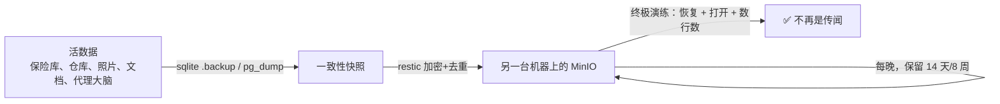

先说实在话：直到上周，我的密码保险库——全家每一条凭据都系于其上的那个文件——都只以单份副本的形态，存在于一台机器的一块磁盘上。那块盘要是死了，我会同时失去所有家庭实验室的凭据。如果这句话说中了你生活中的某样东西（肯定说中了；它说中每个人生活中的某样东西），那这篇文章就是那记提醒：备份系统只花了一个晚上搭建，而*恢复演练*——所有人都跳过的那部分——才是让它变成真的的唯一部分。

<!-- truncate -->

## 什么值得备份（什么不值得）

第一个有用的决定是一条一句话就能装下的范围规则：**凡是互联网能恢复的，绝不备份。** 容器镜像、AI 模型权重、包缓存、种子——全部可重新下载，全部排除。剩下的东西小得出人意料：

- 密码保险库（760 KB——全家最珍贵的千字节）
- Git 锻造场的数据（每个仓库*加上每一条 issue*——我的运维日志本在别处不存在）
- 照片（Immich）、文档（Paperless）——真正不可替代的生活本身
- AI 代理的"大脑"（它的人格文件、技能、记忆——不可替代得很奇妙）

把这条规则套用到代理自己的存储上尤其舒爽：它的运行时目录有 2.8 GB，但其中大头是可重装的二进制和库。真正要紧的部分——互联网无法恢复的部分——只占一个零头，备份配置指名道姓地跳过了其余的一切。

## 一口气说完的设计

每晚的 [restic](https://restic.net/) 任务（加密、去重）把每个数据集推到一台专用 MinIO 服务器上，它唯一的设计准则是：**绝不和你要保护的数据共享节点。** 保险库住在一台机器上；它的备份落在另一台机器的磁盘上。数据库拿到的是*一致性*快照——SQLite 走它自己的备份 API（对一个活数据库做裸文件复制可能在写入中途撕裂它），Postgres 走 `pg_dump`——而不是天真的文件复制。保留十四份每日和八份每周快照，每轮运行附带 10% 的完整性读回校验。

有一个细节我很得意，因为这种东西只有用对抗性思维才能抓到：restic 的加密密码存在密码保险库里……而保险库恰恰是被备份的对象之一。**一个只存在于保险库里的密码，解不开保险库自己的备份。** 所以它被托管在了一个完全位于集群之外的第二处。循环依赖在自托管世界里无处不在地潜伏；这一个要是漏过了，整套备份就成了装饰品。

## 演练（三次尝试，两次是自己坑自己）

"未经测试的备份只是传闻"是开工前就定下的信条，所以在把保险库的备份恢复出来并读到数据之前，这活儿不算干完。这花了三次尝试，而我要把失败留在故事里，因为它们才是诚实的部分——两次都是*我们验证工具*的 bug，不是备份的：

1. **第一次：** 恢复成功了，但验证容器把恢复出来的文件挂载成了只读——而 SQLite 连以只读方式打开都要求能创建它的锁文件。什么也没验证到。
2. **第二次：** 修好了上面那个；然后同一条命令里的清理步骤在*日志还没被读取之前*就把恢复任务删了。（其实发生了两次。这里有一课：别把清理和你正要检查的东西放在同一口气里。）
3. **第三次：** `integrity_check: ok`。两个用户、二十五条密码、一个组织——真实的解密数据，从恢复出来的副本里读出，逐一清点。

最后那一行，就是"我们有备份"和"我们有恢复能力"之间的全部差别。前者是一个勾选框；后者是一项你实际演示过的能力。

## 诚实的缺口

以上一切都住在同一栋房子里。一场火灾、一次水淹、或者一记野心勃勃的电涌就能把它全部击败。异地副本——在云端存储桶里放第二个 restic 目标，按现在的体量大约每月一美元——方案已经定好，就差拍板。我提这一点，是因为任何不承认自己缺口的备份文章都是在推销什么东西。

## 抄走吧

如果你自托管任何有状态的东西：列出那张互联网救不回来的短清单，在它们和一块"不是同一块"的磁盘之间放上 restic，然后——这就是整篇文章——**恢复一份并打开它。** 就今晚。演练只要二十分钟，就能把你的传闻变成事实。
