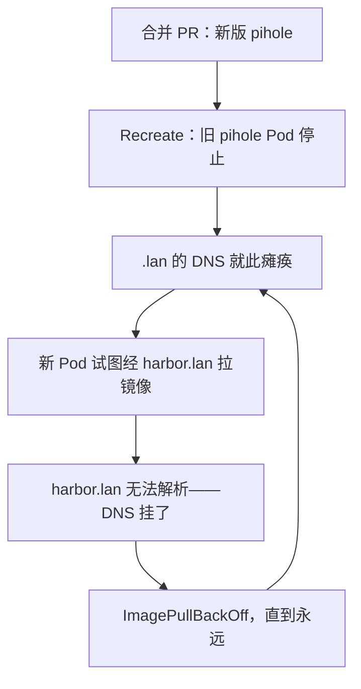

先说实在话：我合并了一个看上去是全世界最无聊的 Pull Request——给家里的 DNS 服务器 Pi-hole 升个版本——然后整栋房子失去了"我家人所理解的互联网"大约十五分钟。这个 bug 是一个货真价实的循环依赖，恢复过程是一份破窗预案严格照本宣科的演出，而永久修复只是 `/etc/hosts` 里的三行。如果你喜欢能装进厨房的分布式系统谜题，这一个是颗宝石。

<!-- truncate -->

## 铺垫

三个事实，单看每一个都很合理：

1. **Pi-hole 为我的局域网提供 DNS**——包括集群机器用来找东西的那些 `.lan` 域名。其中一个是 `harbor.lan`，我的容器镜像仓库，每一次镜像拉取都流经它。
2. **Pi-hole 的 Pod 用的是 `Recreate` 部署策略**——旧 Pod 必须完全停止，新 Pod 才能启动，因为两者都要占用主机的 53 端口。不可能有重叠。
3. **升级 Pi-hole 意味着拉取一个新的容器镜像**——经由 `harbor.lan`。

按顺序再读一遍。升级*先杀掉 DNS 服务器*，然后试图*拉取新镜像*，而拉取需要*解析 `harbor.lan`*，而解析需要……那台 DNS 服务器。升级依赖着升级刚刚杀掉的东西。

## 反转：机器人对抗回滚

显而易见的第一步：把 Deployment 回滚到旧镜像——它还在节点缓存里，不用拉取、不需要 DNS。搞定。可三十秒之后，Deployment *又回到了坏掉的那个版本*。

肇事者是我们自己的自动化，而且它的表现和设计的一模一样好：Argo CD 的自我修复发现了偏离 git 声明状态的手动漂移，把它扭了回去。而后来让我笑出声的细节是——**Argo 干这事根本不需要 DNS**，因为它是从自己*缓存的*期望状态副本来修复的。整条 GitOps 环路当时都因 DNS 而死（Argo 也没法从 `forgejo.lan` 克隆），但免疫系统靠记忆继续工作，忠实地一遍遍把 DNS 重新弄坏。

## 破窗，照章执行

两天前，在迁移那些吓人的服务之前，我们写好了一份"环路断裂时如何操作"的应急预案。它迎来了第一次实战：

1. **把 Argo 控制器缩到零。** 机器安静下来；不再有任何自我修复。
2. **用普通 kubectl 把 pihole 回滚到缓存的镜像。** DNS 几秒内回归。
3. **预拉新镜像**——趁 DNS 好使，在再次尝试升级*之前*先把镜像取到节点上。
4. **把 Argo 叫醒。** 它自我修复到新版本，而新版本现在能从本地缓存瞬间启动。总闪断：几秒钟。

我合并的那次升级其实是完成了的——只不过由一个人类按正确顺序托着流程走完。这份预案在一次事故里就回了本。

## 永久修复

这一类 bug 被一招整族消灭：现在每个节点的 `/etc/hosts` 里都钉着 `harbor.lan`，而解析器查询它*先于* DNS。镜像拉取从此完全不依赖 Pi-hole——包括 Pi-hole 自己未来的升级，如今只会造成几秒钟的闪断，而不是一场死锁。

## 附赠小鬼：MTU bug

同一周，另一只网络幽灵。我们的 CI 运行器在 Kubernetes 里的 Docker-in-Docker 里构建容器镜像，而每一个要下载大文件的构建都死于 `ECONNRESET`——小请求却完美工作。这对症状（小的没事，大的必死）正是 **MTU 不匹配**的经典签名：集群网络把数据包上限压到 1450 字节，而内层 Docker 网桥默认 1500。超限的数据包在下载中途被无声地丢进了黑洞。

一个参数（给内层守护进程加 `--mtu=1400`）修好了之后所有的 CI 构建。可复用的部分是诊断路径：笔记本上能跑 → 普通 Pod 里能跑 → 只在 dind 里失败 → 对比各接口的 MTU。当大传输死掉而小传输没事时，先量一量你的数据包，再去怪互联网。
