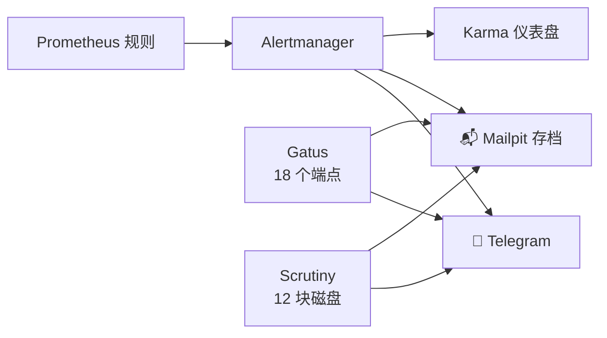

先说实在话：几周以来，我的集群里躺着一批精心编写的告警规则——节点宕机、磁盘将满、模型服务器不对劲——却**没有任何地方可以送达**。Prometheus 忠实地评估着每一条规则，结果全部坠入虚空，因为我从来没装过那个把告警路由给人类的组件。如果你在家跑 Prometheus，现在就去看看你到底有没有 Alertmanager。我等你。这篇文章讲的就是我发现自己没有之后的事。

<!-- truncate -->

## 起因事故

一周前，我的一个节点——跑着集群内 AI 代理的一台笔记本——在凌晨 5:40 无声地死了。电池耗尽；有人拔了它的电源。**十二个小时**里没有任何东西察觉，直到一件不相干的工作碰巧把它翻了出来。整整十二小时的"集群一切正常"，而它的五分之一是关着的。

这就是有监控没告警的问题所在：它是一本日记，不是一个烟雾报警器。数据全都在。只是凌晨 5:40 没有人在读。

## 缺失的器官

发现的那一刻几乎有点好笑："来配置告警路由吧" → "Alertmanager 跑在哪儿？" → *根本没有 Alertmanager*。我的告警规则被评估了好几周，尽职尽责地在 `inactive` 和 `firing` 之间切换，被恰好零个人看见。

那一晚的搭建由 Claude 主驾，我只出了一个 Telegram bot token：

- **Alertmanager**——路由器。规则们终于有了去处。
- **Telegram 作为主通道**——一个会给我手机发消息的 bot。配置真的只有三步：找 BotFather 要一个 bot，把 token 放进保险库，给 bot 发一句 "hi"（代理就是靠这个自动发现了我的 chat ID）。
- **Mailpit 作为常开的记录**——集群里的一个假 SMTP 收件箱。每条告警也会落到那里，就算我把 Telegram 配置按错了，也留有书面记录。
- **Karma**——盖在 Alertmanager 上的仪表盘，手机嗡嗡响的时候，我可以去那里看全景、按静音按钮。
- **从历史里挣来的新规则**——包括"节点失联五分钟"，让那次电池事故再也不可能跑满十二个小时。（尴尬的细节：这条规则的第一版引用了一个不存在的抓取任务名——一条永远不可能触发的装饰性告警。在评审中被抓住了。测试你的烟雾报警器。）
- 然后，同样的两条通道被接进了其他所有会发声的东西：**Gatus**（18 个端点健康检查）和 **Scrutiny**（全部 12 块物理磁盘的 SMART 健康）。一部手机，一个收件箱，所有的发射源。

## 第一条真实的捕获

管线上线几分钟后，一条*真实*告警夹在测试消息之间抵达：一个 vLLM 模型服务器目标，宕机。它已经隐形地"触发"了不知多久——虚空终于有了地板。这立刻教出了下一课：

## 停放不等于宕机

我的推理舰队并不会全员同时在线——GPU 是有限的，所以模型服务器整天被停放（缩到零）和唤醒。对一条天真的 `up == 0` 规则来说，停放的服务和死掉的服务无法区分，我的手机会为那些*我刻意关掉的*服务永远嗡嗡作响。

修复是一种哲学，不是一个过滤器：**在推理命名空间里，存在与否不是信号；行为才是。** 那个舰队的存在性告警被全部删除。留下来的是从指标推导的规则——KV 缓存吃紧、请求积压、首 token 时间过慢——它们*物理上不可能触发*，除非一个模型正在真实地伺服流量，而模型一停放它们就归于沉默。关于"正在运行的东西陷入挣扎"的告警：要。关于"有意为之的操作"的告警：永远不要。服务起起落落时也不需要逐个开关——两个方向都是自动的。

## 收尾一笔

每条告警都带着一个 "Source" 链接，指向触发它的那条 Prometheus 查询。最初几条渲染出来的是一个点不动的内部 Pod 主机名；加一个 `--web.external-url` 参数之后，它们变成了正经的 `prometheus.lan` 链接——在手机上点一下告警，落进图表里，看到完整的故事。

## 抄走吧

被验证有效的操作顺序：选那个你本来就会看的通道（对我是 Telegram——bot 三分钟搞定），把 Alertmanager 放在 Prometheus 和它之间，加一条极简的常开记录通道，然后——让这套系统能长期住人的关键——删掉所有会因*有意状态*而触发的告警。一套你信任的告警系统，只在真出问题时才开口。而现在，当我的集群在凌晨 5:40 不开心时，我的手机在早饭前就知道了。
