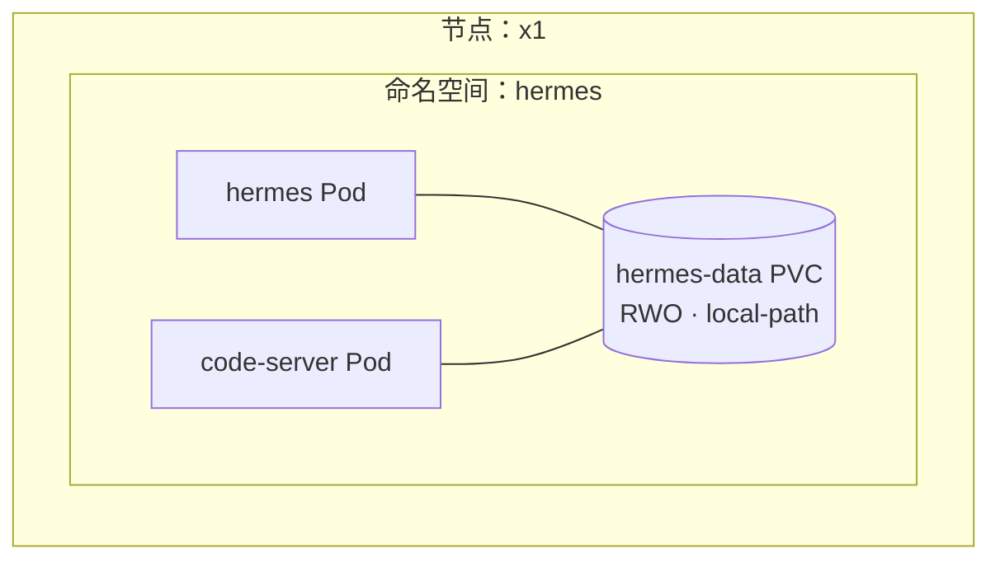

# code-server：浏览器里的开颅手术

**这是什么：** [code-server](https://github.com/coder/code-server) 是以 Web 应用形态运行的 VS Code——完整的编辑器、文件树、终端、扩展——由集群在 `code.lan` 提供。我的这份直接打开在 [Hermes 智能体](./hermes.md)的数据卷里：它的 `SOUL.md` 人格文件、它的配置、它的技能。

**我为什么需要它：** 这个智能体的心智就是 Kubernetes 卷上的一堆文件，而"编辑 PVC 里的文件"通常意味着一段痛苦的 `kubectl exec` + vi 体验。code-server 把它变成一个能实时触达在线文件的真编辑器。想调整 Hermes 说话的方式、或者教它一个新技能时，我只需要打开一个浏览器标签页。

{/* screenshot: ai/code-server-soul.png — SOUL.md open in the editor, file tree showing skills/ */}

## 日常主力

- **编辑 `SOUL.md`**——人格改动下个会话生效，不用重启
- **调 `config.yaml`**——默认模型、服务商设置（这个*确实*需要重启 Hermes）
- **写技能**——智能体的能力就是一些 markdown 文件；我在这里起草
- **集群内部的终端**——偶尔从里面翻翻东西很方便

## 藏在部署里的 Kubernetes 课

这东西*跑在哪里*，比大多数教程都更像一堂好的 k8s 教程：

我想让 code-server 挂载智能体的数据卷。就这一个需求，决定了一切：

1. **PVC 是命名空间级资源**——Pod 只能挂载自己命名空间里的卷，所以 code-server 住*在 hermes 命名空间里*，而不是自立门户。
2. **这块卷是节点本地存储上的 ReadWriteOnce**——RWO 实际上的意思是"一次一个*节点*"，所以两个 Pod *只要在同一个节点上*就可以共享它。因此 code-server 和 Hermes 一起被钉在 x1 上。
3. **卷里的文件归智能体的用户所有（uid 10000），权限很紧**——所以 code-server 就*以* uid 10000 运行，否则每个文件都只是只读的展品。

这些没有一样是黑魔法；只是三条基本功（命名空间作用域、RWO 语义、uid 映射）——大多数人是在生产事故里第一次遇见它们，而不是在设计输入里。

## 那句安全声明

任何拿到 `code.lan` 密码的人，都能编辑常驻智能体的大脑、读它的环境变量。所以这个密码是保险库强度的、仅限局域网、绝不复用——因为"一个对智能体灵魂有写权限的 Web IDE"至少配得上这份尊重。

Manifest：[`clusters/home/code-server/`](https://github.com/briancaffey/home-lab/tree/main/clusters/home/code-server)——有意部署*进* hermes 命名空间，并留了注释解释原因，给下一个想来"修好它"的人看。
