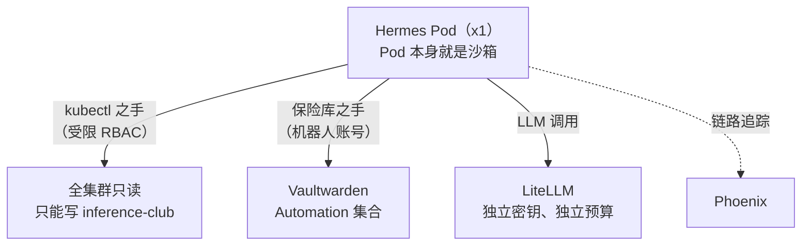

# Hermes：住在这里的智能体

**这是什么：** [Hermes Agent](https://github.com/NousResearch)（来自 Nous Research）以一等公民工作负载的身份跑在集群*内部*——一个位于 x1（纯 CPU 的 ThinkPad 节点）上的 Pod，在 `hermes.lan` 有仪表盘，有一个藏在 bearer key 后面的 OpenAI 兼容 API，整个心智都放在一块持久卷上。如果说 Claude Code 是*从我的笔记本上*操作实验室，那 Hermes 就是*住在*实验室里的那个智能体。

**我为什么要跑它：** 一半是为了实验"常驻智能体到底能做什么"，一半是因为它真的在干活——它能无头渲染视频（hyperframes 技能：HTML→视频，ffmpeg 加 Chromium，全程在 Pod 里完成）、回答关于集群的问题、任务需要时自己去取凭据。它也是这个实验室一直在追问的那个问题的最佳实验对象：*你能安全地委托多少？*

{/* screenshot: ai/hermes-dashboard.png — the dashboard chat view */}

## 它的手（它实际被允许碰什么）

- **kubectl 之手：** 一个 ServiceAccount，全集群*只读*，写权限*仅限*推理命名空间——它可以停放和唤醒模型、重启卡死的 vLLM、诊断任何问题，但碰不了监控栈、数据库，也碰不了它自己。
- **保险库之手：** 一个 `vault-secret` 命令，接到人类工具链所用的同一个 Vaultwarden 机器人账号上——技能里写死了行为守则：绝不打印秘密值、用*使用*凭据的方式证明访问成功、只用精确条目名。（完整故事在[信任体系](../tissue/trust-fabric.md)。）
- **技能：** 操作集群、取凭据、hyperframes 视频渲染——镜像自带 Node、ffmpeg 和无头 Chromium，所以"给我做个关于 X 的视频"完全在 Pod 内渲染完成。

## SOUL.md，或者说：用文本编辑器编辑一个性格

Hermes 的人格住在它数据卷上一个叫 `SOUL.md` 的 markdown 文件里。改这个文件，智能体下一个会话的语气就变了。这件事是深刻还是滑稽，取决于你是几点钟想起它——而且这确实就是上游项目的工作方式。我通过 [code-server](./code-server.md)（挂载进同一块卷的浏览器版 VS Code）来编辑它（以及这个智能体大脑的其余部分）。

## 监督（诚实的部分）

由 API 驱动的智能体任务走 `/v1/runs`，带**审批闸门**：工具执行会暂停，直到人类（或者我自己带白名单的驱动脚本）批准 `once`（这一次）、`session`（这个会话）或 `always`（永远）。安全姿态也说得很直白：保险库之手能读整个 Automation 集合，所以 **Hermes 只处理可信输入**——它不会把公开互联网读进自己的提示词。哪天这一点变了，它会先拿到一个第二个、权限更小的机器人账号。

它的大脑和家里其他要紧东西一样，每晚由 restic 备份——事实证明，一个智能体积累下来的记忆，是这屋子里比较难以替代的东西之一。

Manifest：[`clusters/home/hermes/`](https://github.com/briancaffey/home-lab/tree/main/clusters/home/hermes)。
