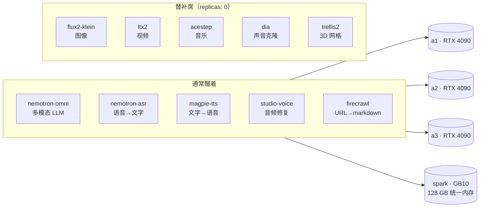

# 推理服务舰队

**这是什么：** 一个叫 `inference-club` 的命名空间，AI 模型们以 Kubernetes 服务的身份住在这里——多模态 LLM、语音转文字、文字转语音、图像生成、视频生成、语音增强、网页抓取，还有一排停放着的实验品。每个服务都是一个包着模型服务器的容器（大多数是 [vLLM](https://github.com/vllm-project/vllm)，也有一些是 NVIDIA NIM 或自定义服务器），并且每个都有一个稳定的 `https://<name>.lan` 地址，`/docs` 路径下还有 OpenAPI 页面。

**我为什么要跑它：** 因为"调用 API"和"拥有 API"是两种不同的爱好。在家里跑模型意味着实验不用按 token 付费、没有速率限制、数据不出家门——还逼着你真正搞懂 GPU、VRAM 和调度。这支舰队就是这个集群存在的*理由*；这个网站上的其他一切都只是配角。

{/* screenshot: ai/inference-fleet-homepage-tiles.png — the Inference group on home.lan, compact indicator row */}

## 阵容名单

## 日常主力

- **聊天与推理**走 `omni.lan`（通常由 [LiteLLM](./litellm.md) 代理，不直接调用）
- **转录**用 `asr.lan`——音频进、文字出，跑在 spark 的统一内存上
- **配音**来自 `magpie.lan`——各种项目背后的 TTS
- **抓取**用 `firecrawl.lan`——URL 进、干净的 markdown 出，喂给各路智能体
- **唤醒某个服务**当项目需要时：一句 `kubectl scale`，模型就醒了

## 这里的配置方式（有意思的部分）

**GPU 是刻意共享的，不是自动共享的。** 一个 Pod 要么独占整块 GPU（`nvidia.com/gpu: 1`——由调度器强制排他），要么加入"君子协定"（`NVIDIA_VISIBLE_DEVICES=all` 且*不*声明 GPU 资源——几个 Pod 共享一块卡，而调度器对此一无所知）。这里没有 time-slicing 也没有 MPS；一个自制的 `vram-reporter` 在带外记账。一块 RTX 4090 有 24 GB VRAM，每个模型大概吃多少，我心里有数。

**"停放"是一等公民的生活方式。** 我没法同时跑所有东西——光是视频生成就能吃掉一整块卡——所以服务频繁地缩到零再扩回来。这塑造了两个实实在在的架构决策：

- **GitOps 在这里不管副本数。** `services/*` 的 Argo CD Application 都带一条针对 `/spec/replicas` 的 `ignoreDifferences` 规则——git 拥有一个服务*是什么*，但*它醒不醒着*属于我和 Hermes，任何同步都不会重置一次扩缩容决定。
- **告警里"停放不等于宕机"。** 舰队的存在性告警被禁用了；只有*行为*告警（KV-cache 压力、请求积压、首 token 变慢）才可能触发——而这些都是从实时指标算出来的，所以一个停放中的服务就是安安静静的。参见[告警](../observability/alerting.md)。

manifest 都在 [`services/`](https://github.com/briancaffey/home-lab/tree/main/services) 里——每个模型服务器一个目录，纯 YAML，每个都是一个 Argo Application。
